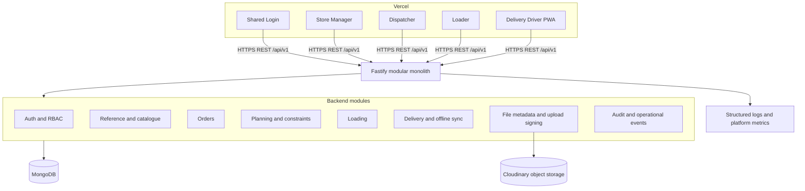
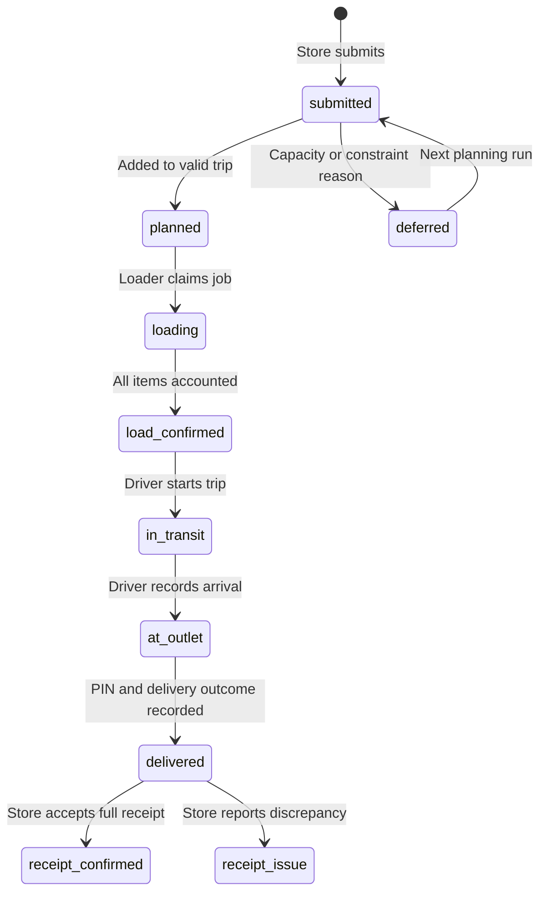
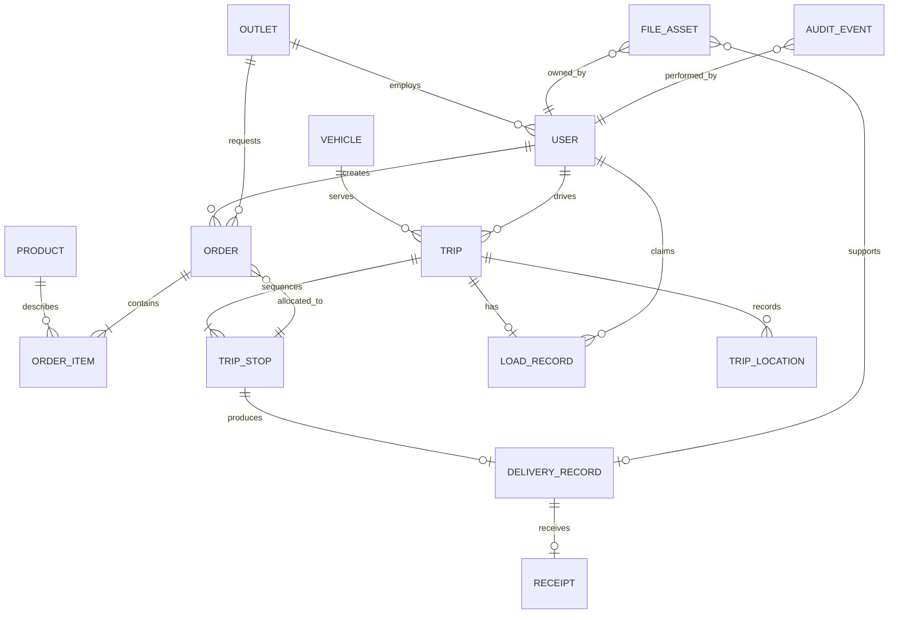
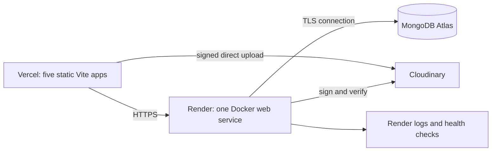

# WayLink system requirements and architecture proposal

Status: architecture review draft - no backend implementation has started  
Prepared: 30 September 2026  
Scope: the five deployed frontends, shared challenge data, one centralized backend

## 1. Executive recommendation

Build one **TypeScript modular monolith** using Node.js, Fastify, MongoDB, and Mongoose. Expose one versioned REST API to all five Vercel frontends. Use a background-free request model for the hackathon: no microservices, Redis, queue broker, Kubernetes, or event bus.

The five deployments are not five independent business systems. They are five faces of one delivery workflow:

1. Shared Login authenticates an employee with employee ID, password, and the employee's recorded email, then hands the session to the correct role application.
2. Store Manager creates orders and later confirms receipt.
3. Dispatcher closes the order queue, allocates valid trips, records deferrals, and monitors execution.
4. Loader claims a planned trip, loads by reverse stop sequence, and records shortages or damage.
5. Delivery Driver executes the route, records delivery proof while offline if needed, and synchronizes later.

The backend must make `Order`, `Trip`, `TripStop`, `LoadRecord`, and `DeliveryRecord` canonical. The frontend mock objects cannot remain separate sources of truth.

### Recommended stack

| Layer | Choice | Why | Hackathon need | Simpler alternative |
|---|---|---|---|---|
| Runtime | Node.js 22 + TypeScript | Matches all frontend teams and supports shared DTOs | Yes | Plain JavaScript, but weaker contracts |
| HTTP | Fastify | Built-in schema validation, good logging, low boilerplate | Yes | Express + Zod; acceptable if the team already knows Express |
| Database | MongoDB 8 + Mongoose | User requested MongoDB; documents fit order snapshots and stop/item records | Yes | PostgreSQL is stronger for heavy relational reporting, but switching now adds time |
| API | REST/JSON under `/api/v1` | Easy for five Vite apps and Swagger | Yes | GraphQL adds unnecessary schema/client work |
| Validation | TypeBox/Fastify JSON Schema at the boundary; Mongoose validation in persistence | One schema can drive runtime checks and OpenAPI | Yes | Zod is also suitable with Express |
| Authentication | Short-lived JWT bearer token plus one-time cross-origin handoff code | Works across separate Vercel origins without sharing browser storage; no login OTP or forgot-password flow | Yes | A shared parent domain with cookies is better later, but requires DNS and cookie coordination |
| Files | Cloudinary signed uploads for images; MongoDB stores metadata only | Fastest path for meter/evidence photos | Only for implemented photo flows | Multipart through API is simpler conceptually but consumes backend bandwidth |
| Deployment | Render Docker web service + MongoDB Atlas | Fast Docker deploy, health checks, managed database | Yes | Railway is viable if the team already has it configured |
| Live updates | 10-15 second polling | Enough for dispatcher/store visibility | Yes | WebSockets only if judges require sub-second live tracking |
| API docs | Fastify Swagger/OpenAPI 3.1 | Frontend teams get an executable contract | Yes | Static Markdown tables alone will drift |
| Logs | Fastify/Pino structured JSON | Request IDs and searchable errors with almost no setup | Yes | `console.log` is insufficient for multi-role debugging |

## 2. Sources reviewed

The proposal is based on:

- `hackathon-host/Login`: shared login, legacy forgot-password/OTP screens to remove, role routing, mock users.
- `hackathon-host/dispatcher`: order queue, assisted trip planning, vehicle limits, deferrals, monitoring, remarks, logs, PDF/CSV exports.
- `hackathon-host/loader`: load claiming, reverse-stop loading, item exceptions, reconciliation, confirmation, offline indicators.
- `hackathon-host/Store-Manager`: ordering, cut-off behavior, order history, delivery states, arrival PIN, receipt confirmation, issue evidence.
- `hackathon-host/delivery-driver`: route selection, meter photos, stop checklist, PIN proof, maps, route completion, offline sync.
- `Challenge Booklet.pdf`: official operating constraints and Hackathon deliverables.
- `Kick-off Session Tech-triathlon 2026.pptx`: one operation/one system, end-to-end judge flow, Docker Compose and seed expectations.
- `Drive Data/*.csv`: 120 outlets, 60 vehicles, two depots, calendar, travel, service allowance, traffic, and road conditions.
- Existing audit/planning documents in the repository were treated as supporting analysis and checked against source code.

## 3. System requirements summary

### 3.1 Shared Login frontend

**Users:** dispatcher, loader, driver, store manager.

**Current journeys**

- Sign in with employee ID, password, and email.
- If an account does not yet have a verified profile email during seed/import or an approved registration flow, request it once and persist it before continuing.
- Route the authenticated user to the correct deployed role application.
- Log out from a role application and return to shared Login.

**Inputs**

- Login: `employeeId`, `password`, `email`.
- Seed/admin registration: employee identity, role, name, email, and initial password. Public self-registration is outside the current hackathon scope.

**Persistent data**

- User identity, role, employee ID, normalized email, email verification state, and password hash.
- Login audit events.

**Temporary data**

- One-time cross-origin handoff code. This is a random redirect-exchange credential, not an OTP shown to the user.
- The role app may cache the authenticated user's name, role, and email for offline display. MongoDB remains the source of truth for email; never rely on local storage as the only copy.

**Backend needs**

- Login, current user, logout, approved email capture/update, and handoff-code exchange.
- Server-side role enforcement. Frontend route guards are display logic only.

**Removed from scope:** forgot password, login OTP verification, OTP resend, and login/change-OTP UI. PIN verification for proof of delivery remains a separate operational flow and is not removed.

**Critical gap:** the current Login app writes a token to `sessionStorage`, removes it before redirecting to another origin, and therefore does not authenticate the destination app. Browser storage is origin-scoped. Loader has no auth wiring, Driver has a separate embedded login, and the role apps mostly use hard-coded profile data.

### 3.2 Store Manager frontend

**User:** the manager of one outlet, using desktop or phone.

**Main journeys**

- View the next delivery, upcoming deliveries, attention items, and recent activity.
- Browse a brand-specific catalogue and create dry, chilled, Style, or Tech orders.
- Review quantities against a live countdown to the 4:00 PM order cutoff. Submissions before 4:00 PM enter the next planning run; submissions at or after 4:00 PM enter the following run.
- Track an order through confirmed, deferred, scheduled, on the way, arrived, awaiting confirmation, and receipt complete.
- Open a persistent Order History containing all submitted, allocated, deferred, cancelled, and completed orders for the manager's outlet.
- Open a persistent Delivery History containing upcoming, completed, partial, failed, and receipt-issue deliveries for the manager's outlet.
- Display an arrival PIN for the assigned driver.
- Confirm a full receipt or record per-item problems: missing, damaged, temperature, wrong variant/item, seal, condition, or other.
- Add an optional remark and photo to a receipt issue.

**Inputs**

- Product search, quantities, order type.
- Per-item received/damaged quantities and issue classification.
- Optional receipt remark and evidence photo.

**Persistent data**

- Outlet profile, catalogue, orders/items, cut-off decision, status history, deferral details, delivery ETA, proof PIN, receipt and issue evidence.

**Temporary data**

- Unsaved order draft and UI filters. A local draft can be retained in browser storage, but the submitted order must be server-owned.

**Backend needs**

- Outlet dashboard; catalogue; order create/list/detail/history; delivery list/detail/history; active delivery PIN; receipt submission; image-upload signature.

### 3.3 Dispatcher frontend

**User:** dispatcher at the Peliyagoda planning office on a large screen.

**Main journeys**

- See confirmed orders by date and brand.
- Filter emergency, reachable, suggested, deferred, and due orders.
- Create a trip with departure date/time, orders, route tags, and vehicle.
- Receive vehicle suggestions, then review weight/capacity before scheduling.
- Respect vehicle turns, weekly distance/fuel quota, type, temperature, and access limits.
- Defer selected orders to a later run with structured reasons and a notice.
- Monitor active trips, stop progress, ETAs, driver location, and remarks.
- Review/respond to loader, driver, and store-manager remarks.
- Inspect order history and export CSV; download a route summary.
- Verify the 4:00 PM order cutoff and each outlet delivery deadline during planning; Fresh stops normally require completion before 8:00 AM, with an earlier CSV outlet close time taking precedence.

**Inputs**

- Planning date/time, selected orders, vehicle, route tags.
- Deferral date, reason(s), notice.
- Vehicle quota override values.
- Remark response, reviewed status, and notification recipients.
- Order notice and whether to share it with the crew.

**Persistent data**

- Planning decisions, validation results, trips/stops, deferrals, vehicle weekly usage, remarks, status history, audit trail.

**Temporary data**

- Filters, calendar selection, review/check-sheet selections.

**Backend needs**

- Planning queue and constraint validation; trip CRUD/state actions; deferral; vehicle usage; live trip monitor; remarks; order history/export.

**Critical gap:** current scheduling removes mock orders with array slicing rather than saving a plan. Vehicle quota changes and approvals live only in React state.

### 3.4 Loader frontend

**User:** warehouse loader at Peliyagoda or Kandy on a shared tablet/terminal.

**Main journeys**

- Refresh available load jobs, open a confirmation popup reading **"Are you sure you really need to claim this load?"**, and claim only after explicit confirmation.
- Unclaim a load before loading begins. Once the first item is changed or loading is explicitly started, unclaim is blocked and Dispatcher reassignment is required.
- View vehicle, route, stop order, departure deadline, and item list.
- Mark items loaded in stop sequence.
- Flag missing/damaged items with affected quantity, structured reason, optional note, and offline status.
- Reconcile all stops and exceptions.
- Confirm loading and download a PDF summary.

**Inputs**

- Claim confirmation and pre-loading unclaim actions.
- Item loaded action.
- Exception type, affected quantity, reason, optional note.
- Final load confirmation.

**Persistent data**

- Claim ownership/time, item accounting, exceptions, confirmation time, departure variance, loader identity.

**Temporary data**

- Current screen/stop and filters are cached in IndexedDB as offline-first device memory; the downloaded PDF is optional. In-memory React state alone is not authoritative.

**Backend needs**

- Available load jobs; atomic claim; guarded unclaim before loading starts; load detail; item status update; exception create/update; reconciliation; confirm.

**Critical gap:** all active state is currently volatile and a claimed load cannot be released. The target Loader architecture uses offline-first IndexedDB device memory after claim, supports unclaim before loading begins, preserves load records across refresh, and prevents two loaders from owning the same trip.

### 3.5 Delivery Driver frontend

**User:** driver on a personal phone, interacting only while safely stopped.

**Main journeys**

- While online, view fresh assignments, open the same strong claim-confirmation popup, claim an assignment, and confirm the actual vehicle. A Driver may use different vehicles across trips and has no two-vehicle limit.
- Immediately cache the complete assignment, manifest, vehicle, route, deadlines, and histories locally.
- Capture a start meter photo and begin the trip.
- Start mandatory GPS monitoring with the active trip. The workflow always enters the internal map/tracking state, although the driver does not need to keep the map screen visible.
- Follow ordered stops and open map directions.
- Check delivered products during unloading.
- Enter the store manager's four-digit PIN to prove delivery.
- Record the stop locally while offline and synchronize later.
- Capture an end meter photo, finish the route, and review shift summary.
- Open Driver Order History and Delivery History for previous assigned orders, stops, outcomes, and proofs.

**Inputs**

- Online assignment claim/unclaim, vehicle confirmation, route selection, and GPS permission.
- Start/end meter photo.
- Product checklist.
- Four-digit delivery PIN.
- Mandatory active-trip location capture, queued location batches, and sync retry.

**Persistent data**

- Assigned route/manifest snapshot, confirmed vehicle, start/end times, arrival/completion times, delays, pickups, per-item outcome, proof result, sync state, meter-photo metadata, location trail, and Driver histories.

**Temporary/device data**

- All active Driver data in IndexedDB: assignment/manifest snapshot, orders, stops, products, confirmed vehicle, countdown/window data, required history, action queue, location queue, proof metadata, and unuploaded image blobs. `localStorage` is limited to tiny non-sensitive flags; in-memory state alone is never authoritative.
- Current map position and UI navigation state.

**Backend needs**

- Online assignment claim/unclaim and vehicle confirmation; local manifest bootstrap; trip start/finish; stop arrival/checklist/complete; PIN verification; meter-photo metadata; mandatory location batches; Driver order/delivery history; idempotent batch sync.

**Critical gaps:** the active prototype store is memory-only despite a separate unused route context that has local persistence; checklist supports only checked/unchecked, while the official workflow requires stop outcomes and shortfalls; mock routes incorrectly treat the two-routes-per-day rule as a Driver limit rather than a Vehicle limit; IDs and people do not match shared data.

### 3.6 Cutoff countdowns and verification rules

The system has two distinct time rules and must show both as live countdowns:

1. **Before 4:00 PM - order cutoff.** Store Manager ordering shows time remaining until 16:00 Asia/Colombo. The backend determines the cutoff bucket from server time. An order submitted at or after 16:00 is accepted for the following planning run, never silently inserted into the closed run.
2. **Before 8:00 AM - Fresh delivery deadline.** Planning, Driver, Dispatcher, and Store Manager surfaces show time remaining until the applicable outlet window closes. Fresh delivery is generally before 08:00, but a CSV window such as 07:30 is stricter and therefore wins. The backend verifies planned arrival, actual arrival, PIN proof, and delivery completion against that outlet window and records `on_time` or `late`.

There is no general rule that deliveries must occur before 4:00 PM. The 4:00 PM rule closes next-day ordering. Delivery validation uses the outlet's own `windowClose`, including the Fresh-before-8 rule.

Countdown displays are advisory and use a server-provided deadline plus client ticking. Server timestamps and Asia/Colombo timezone logic are authoritative; changing a device clock cannot bypass either rule.

### 3.7 Explicitly excluded cash features

Cash collection, cash-in-season, cash settlement, cash reconciliation, seasonal cash handling, and related UI are outside scope. The architecture defines no cash collection, payment, till, settlement, or seasonal-cash database fields or endpoints. Official calendar flags such as payday or festival may remain read-only planning/forecast reference data, but they do not create a cash feature.

### 3.8 Shared cross-role workflow

```text
Store Manager        Dispatcher             Loader              Driver             Store Manager
     |                    |                    |                   |                      |
create order ------------>|                    |                   |                      |
     |              close planning queue      |                   |                      |
     |              allocate or defer          |                   |                      |
     |<------------- status / deferral notice  |                   |                      |
     |                    |--- publish load --->|                   |                      |
     |                    |                    |-- confirm load --->|                      |
     |                    |<-- exceptions ------|                   |                      |
     |                    |                    |                   |-- deliver + PIN ---->|
     |                    |<-------------- progress / issues -------|                      |
     |<------------------------------------------------ delivery ready for receipt --------|
     |----------------------------------- confirm receipt / issue ------------------------->|
     |                    |<---------------- receipt issue ---------------------------------|
```

### 3.9 Persistent versus temporary data

| Data | Persistent? | Reason |
|---|---:|---|
| Users, roles, employee identity | Yes | Authentication and audit |
| Outlets, vehicles, products, calendar/travel reference | Yes | Shared canonical constraints |
| Order drafts before submit | Optional | Convenience only; local browser draft is acceptable |
| Submitted orders and items | Yes | Planning source of truth |
| Trip drafts | Yes after first save | Multi-user planning and validation |
| Filters, open modal, selected tab | No | UI state |
| Loader claim and item accounting | Device and server | IndexedDB preserves claimed work; server prevents double claim and allows pre-loading unclaim |
| Driver active-trip dataset and history | Device immediately, then server | IndexedDB must preserve the entire executable trip and required history across reload/offline periods |
| Driver offline action/location queues | Device until acknowledged by server | Must survive loss of connectivity/reload and synchronize idempotently |
| PIN plaintext | No | Store only a short-lived hash; show plaintext only to authorized store manager when issued |
| Meter/evidence image binary | Object storage | Avoid database bloat |
| Image metadata and ownership | Yes, MongoDB | Authorization and audit |
| Logs/audit events | Yes with retention | Explain operational decisions |

## 4. Architecture

### 4.1 System architecture



### 4.2 Component boundaries

```text
HTTP route -> authentication -> RBAC -> request validation -> controller
           -> domain service -> repository -> MongoDB
                                      |-> audit event
                                      |-> file signing adapter
```

Controllers translate HTTP only. Domain services own business rules. Repositories own MongoDB queries. A module may call another module's service, never another module's repository directly.

### 4.3 Why a modular monolith

- All roles share one transaction-like workflow and one small team owns it.
- One deploy and one database are fastest to debug during a hackathon.
- Module boundaries still let developers work independently.
- Microservices would add service discovery, cross-service auth, distributed failure, multiple deploys, and data consistency work with no demonstrated load requirement.

### 4.4 Canonical state model



State transitions are server actions, not arbitrary status patches. Every transition writes an operational event with actor, time, old state, new state, and reason.

## 5. Target backend repository structure

```text
backend/
├── src/
│   ├── app.ts
│   ├── server.ts
│   ├── config/
│   │   ├── env.ts
│   │   ├── database.ts
│   │   └── logger.ts
│   ├── plugins/
│   │   ├── auth.ts
│   │   ├── cors.ts
│   │   ├── error-handler.ts
│   │   ├── rate-limit.ts
│   │   └── swagger.ts
│   ├── modules/
│   │   ├── auth/
│   │   ├── users/
│   │   ├── reference/
│   │   ├── catalog/
│   │   ├── orders/
│   │   ├── planning/
│   │   ├── trips/
│   │   ├── loading/
│   │   ├── delivery/
│   │   ├── files/
│   │   └── audit/
│   │       └── each module: route, schema, controller, service, repository, model, types
│   ├── shared/
│   │   ├── errors/
│   │   ├── middleware/
│   │   ├── pagination/
│   │   └── utils/
│   └── types/
├── database/
│   ├── seeds/
│   │   ├── import-shared-csv.ts
│   │   ├── seed-catalog.ts
│   │   ├── seed-users.ts
│   │   └── seed-demo-day.ts
│   └── validators/
├── docs/
│   ├── architecture.md
│   ├── data-model.md
│   ├── api.openapi.yaml
│   └── decisions/
├── tests/
│   ├── unit/
│   ├── integration/
│   ├── contract/
│   └── fixtures/
├── Dockerfile
├── docker-compose.yml
├── package.json
├── tsconfig.json
└── .env.example
```

## 6. MongoDB data model

### 6.1 Design rules

- Use MongoDB `ObjectId` as the internal `_id` and preserve official IDs such as `OUT001` and `VEH001` in unique business-key fields.
- Embed bounded data that is read and changed together: order items, trip stops, load item accounting, status history.
- Reference independently managed or reused records: users, outlets, vehicles, orders, trips, file assets.
- Copy a small immutable snapshot of names, constraints, and quantities into operational records so history remains explainable if reference data changes.
- Use optimistic concurrency with `version` on trips, load records, delivery records, and offline mutations.
- MongoDB has no foreign keys. Services validate references before writes; unique indexes and JSON Schema validators enforce shape and local constraints.
- All timestamps are BSON `Date` stored in UTC. API responses use ISO 8601. Planning dates additionally store the local `serviceDate` as `YYYY-MM-DD` in `Asia/Colombo`.
- Never delete operational history during the demo. Use `archivedAt` or a terminal status.

### 6.2 Entity relationship diagram



`ORDER_ITEM`, `TRIP_STOP`, and `RECEIPT` are embedded document concepts rather than standalone collections in the hackathon schema.

### 6.3 Collections

#### `users`

Store Manager remains a persisted database role. A Store Manager is a `users` record with `role: "store_manager"` and a required `outletId`; this keeps authentication centralized without deleting or weakening the role.

| Field | BSON type | Required/default | Constraint |
|---|---|---|---|
| `_id` | ObjectId | required | primary key |
| `employeeId` | string | required | uppercase, unique, `^[A-Z]{3}-\d{4}$` |
| `name` | string | required | 2-100 chars |
| `role` | string | required | `dispatcher`, `loader`, `driver`, `store_manager` |
| `passwordHash` | string | required | never returned |
| `email` | string | required | trimmed/lowercase, valid email, unique; persisted in MongoDB |
| `emailVerifiedAt` | date | nullable | set by trusted seed/admin import or a future non-login verification flow |
| `phoneE164` | string | optional | unique sparse; not used for login recovery |
| `outletId` | ObjectId | store manager only | must reference outlet |
| `depot` | string | loader/dispatcher/driver optional | `Peliyagoda`, `Kandy` |
| `active` | boolean | default `true` | disabled accounts cannot sign in |
| `failedLoginCount` | int | default `0` | min 0 |
| `lockedUntil` | date | nullable | account lock |
| `lastLoginAt` | date | nullable | audit convenience |
| `createdAt`, `updatedAt` | date | required | timestamps |

Indexes: unique `{employeeId:1}`, unique `{email:1}`, sparse unique `{phoneE164:1}`, `{role:1, active:1}`.

#### `auth_handoffs`

Stores only the short-lived cross-origin login handoff. This is not a visible login OTP and does not support forgot-password or change-OTP behavior.

| Field | BSON type | Required/default | Constraint |
|---|---|---|---|
| `_id` | ObjectId | required | primary key |
| `userId` | ObjectId | required | valid user |
| `secretHash` | string | required | hash of code, never plaintext |
| `redirectOrigin` | string | required | must be configured role origin |
| `expiresAt` | date | required | TTL |
| `usedAt` | date | nullable | one-time use |
| `createdAt` | date | required | audit |

Indexes: TTL `{expiresAt:1}`, `{userId:1,createdAt:-1}`.

#### `outlets`

Seed from `Drive Data/outlets.csv`.

| Field | BSON type | Required/default | Constraint |
|---|---|---|---|
| `_id` | ObjectId | required | primary key |
| `outletId` | string | required | official unique ID such as `OUT001` |
| `displayName` | string | required | explicit seed assumption because CSV contains no name |
| `brand` | string | required | `Fresh`, `Style`, `Tech` |
| `district` | string | required | dataset value |
| `depot` | string | required | `Peliyagoda`, `Kandy` |
| `dockType` | string | required | `rear_dock`, `street`, `mall_bay` |
| `parkingConstraint` | string | required | `normal`, `van_only`, `mall_dock` |
| `mallWindow` | string | nullable | raw dataset value if present |
| `windowOpen`, `windowClose` | string | required | local `HH:mm` |
| `location` | GeoJSON Point | optional initially | required for real map/routing |
| `active` | boolean | default `true` | soft retirement |
| `createdAt`, `updatedAt` | date | required | timestamps |

Indexes: unique `{outletId:1}`, `{depot:1,brand:1}`, `{district:1}`, `2dsphere {location:"2dsphere"}` when coordinates exist.

#### `vehicles`

Seed from `Drive Data/vehicles.csv`.

| Field | BSON type | Required/default | Constraint |
|---|---|---|---|
| `_id` | ObjectId | required | primary key |
| `vehicleId` | string | required | official unique ID such as `VEH001` |
| `type` | string | required | `truck`, `van` |
| `temperature` | string | required | `ambient`, `reefer` |
| `weightCapacityKg` | double | required | > 0 |
| `volumeCapacityM3` | double | required | > 0 |
| `fuelType` | string | required | dataset value |
| `kmPerL` | double | required | > 0 |
| `weeklyFuelQuotaL` | double | required | > 0 |
| `depot` | string | required | `Peliyagoda`, `Kandy` |
| `active` | boolean | default `true` | allocation filter |
| `createdAt`, `updatedAt` | date | required | timestamps |

Indexes: unique `{vehicleId:1}`, `{depot:1,active:1,type:1,temperature:1}`.

#### `products`

The product list comes from **C / CSC** and CSC is the single source of truth. Import the well-defined CSC catalogue rather than inventing product names in individual frontends. The backend augments CSC products with the planning attributes required for allocation, including per-unit weight, volume, temperature class, and fragility. If any required planning attribute is absent from the supplied CSC extract, document the temporary seeded value and obtain CSC confirmation rather than treating frontend mock data as authoritative.

| Field | BSON type | Required/default | Constraint |
|---|---|---|---|
| `_id` | ObjectId | required | primary key |
| `sku` | string | required | unique business key |
| `brand` | string | required | `Fresh`, `Style`, `Tech` |
| `name` | string | required | 2-120 chars |
| `unit` | string | required | e.g. bag, carton, kg, unit |
| `unitWeightKg` | double | required | >= 0 |
| `unitVolumeM3` | double | required | >= 0 |
| `temperature` | string | default `ambient` | `ambient`, `chilled`, `frozen` |
| `fragile` | boolean | default `false` | Tech handling |
| `active` | boolean | default `true` | catalogue filter |

Indexes: unique `{sku:1}`, `{brand:1,active:1,name:1}`. A compound text index on name is optional for this small catalogue.

#### `orders`

Order items embed the product snapshot and calculated totals.

| Field | BSON type | Required/default | Constraint |
|---|---|---|---|
| `_id` | ObjectId | required | primary key |
| `orderNumber` | string | required | unique, e.g. `ORD-0001082` |
| `outletId` | ObjectId | required | valid outlet |
| `createdBy` | ObjectId | required | store manager for same outlet |
| `brand` | string | required | must match outlet |
| `orderType` | string | required | `dry`, `chilled`, `products` |
| `requestedDeliveryDate` | string | required | operating day `YYYY-MM-DD` |
| `submittedAt` | date | required | server time |
| `cutoffDeadlineAt` | date | required | 16:00 Asia/Colombo for the applicable ordering day |
| `submittedBeforeCutoff` | boolean | required | server-calculated |
| `cutoffBucket` | string | required | `next_run`, `following_run` |
| `priority` | string | default `normal` | `normal`, `urgent` |
| `status` | string | default `submitted` | controlled state enum |
| `items[]` | document array | required, min 1 | fields below |
| `items[].sku`, `name`, `unit` | string | required | immutable snapshot |
| `items[].quantity` | double | required | > 0 |
| `items[].unitWeightKg`, `unitVolumeM3` | double | required | >= 0 |
| `items[].temperature` | string | required | ambient/chilled/frozen |
| `totals.weightKg`, `totals.volumeM3` | double | required | server-calculated |
| `deferral` | document | nullable | reasonCode, note, deferredBy, deferredAt, nextDate |
| `allocation` | document | nullable | tripId, tripStopId, allocatedAt |
| `statusHistory[]` | document array | required | from, to, at, actorId, reason |
| `version` | int | default `1` | optimistic concurrency |
| `createdAt`, `updatedAt` | date | required | timestamps |

Indexes: unique `{orderNumber:1}`, `{outletId:1,submittedAt:-1}`, `{status:1,requestedDeliveryDate:1,brand:1}`, `{allocation.tripId:1}`, `{cutoffBucket:1,status:1}`.

#### `trips`

One trip is one vehicle run. `stops` is bounded by the demo route and embeds planning snapshots.

| Field | BSON type | Required/default | Constraint |
|---|---|---|---|
| `_id` | ObjectId | required | primary key |
| `tripNumber` | string | required | unique human ID |
| `serviceDate` | string | required | local operating date |
| `depot` | string | required | must match vehicle |
| `vehicleId` | ObjectId | required | valid active vehicle |
| `driverId` | ObjectId | required | active driver |
| `routeIndex` | int | required | `1` or `2` for this vehicle/day; not a Driver limit |
| `driverClaim` | document | nullable | claimedBy, claimedAt, vehicleConfirmedAt, unclaimedAt |
| `status` | string | default `draft` | `draft`, `published`, `loading`, `load_confirmed`, `in_transit`, `completed`, `cancelled` |
| `plannedDepartureAt`, `plannedEndAt` | date | required when published | chronological |
| `actualStartAt`, `actualEndAt` | date | nullable | execution |
| `totals.weightKg`, `volumeM3`, `distanceKm`, `fuelLitres` | double | required | >= 0 |
| `constraintCheck` | document | required before publish | valid flag and rule results |
| `stops[]` | document array | min 1 when published | fields below |
| `stops[].stopId` | ObjectId | required | stable embedded ID |
| `stops[].sequence` | int | required | unique within trip, starts 1 |
| `stops[].outletId`, `outletSnapshot` | ObjectId/document | required | route target and history |
| `stops[].orderIds` | ObjectId array | required, min 1 | supports two Fresh orders at one outlet |
| `stops[].plannedArrivalAt` | date | required | must respect window to publish |
| `stops[].windowDeadlineAt` | date | required | outlet close time; Fresh is no later than 08:00 |
| `stops[].timingResult` | string | nullable | `on_time` or `late`, set from actual verification |
| `stops[].status` | string | default `pending` | pending/arrived/delivered/failed/deferred |
| `stops[].version` | int | default `1` | offline conflict base |
| `lastLocation` | GeoJSON Point document | nullable | point, accuracy, recordedAt |
| `createdBy`, `publishedBy` | ObjectId | required/nullable | dispatcher |
| `version` | int | default `1` | optimistic concurrency |
| `createdAt`, `updatedAt` | date | required | timestamps |

Indexes: unique `{tripNumber:1}`, unique `{vehicleId:1,serviceDate:1,routeIndex:1}`, `{driverId:1,serviceDate:1}`, `{status:1,serviceDate:1}`, `{stops.orderIds:1}`, `2dsphere {lastLocation.point:"2dsphere"}`. A Driver may appear in more than two trips and may use multiple vehicles; only the unique vehicle/date/routeIndex constraint enforces the twice-daily rule.

#### `load_records`

| Field | BSON type | Required/default | Constraint |
|---|---|---|---|
| `_id` | ObjectId | required | primary key |
| `tripId` | ObjectId | required | unique one-to-one trip |
| `status` | string | default `available` | available/claimed/loading/reconciliation/confirmed |
| `claimedBy`, `claimedAt` | ObjectId/date | nullable | atomic claim pair |
| `loadingStartedAt` | date | nullable | once set, ordinary unclaim is prohibited |
| `unclaimedBy`, `unclaimedAt`, `unclaimReason` | ObjectId/date/string | nullable | audit of a pre-loading release |
| `confirmedBy`, `confirmedAt` | ObjectId/date | nullable | loader confirmation |
| `items[]` | document array | generated from trip/order snapshots | stopId, orderId, sku, expectedQuantity, loadedQuantity, status |
| `items[].exception` | document | nullable | type, affectedQuantity, reasonCode, note, recordedBy/At, syncStatus |
| `departureVarianceSeconds` | int | nullable | positive means early |
| `version` | int | default `1` | concurrency |
| `createdAt`, `updatedAt` | date | required | timestamps |

Indexes: unique `{tripId:1}`, `{status:1,"tripSnapshot.depot":1}`, `{claimedBy:1,status:1}`.

#### `delivery_records`

One record per trip stop. It holds stop execution, driver-reported outcomes, proof, and the store receipt.

| Field | BSON type | Required/default | Constraint |
|---|---|---|---|
| `_id` | ObjectId | required | primary key |
| `tripId`, `stopId`, `outletId` | ObjectId | required | unique trip/stop pair |
| `driverId` | ObjectId | required | assigned driver |
| `status` | string | default `pending` | pending/arrived/delivered/failed/receipt_confirmed/receipt_issue |
| `arrivedAt`, `completedAt` | date | nullable | device time retained plus server receipt time |
| `windowDeadlineAt` | date | required | copied from trip stop for offline countdown and verification |
| `timingResult` | string | nullable | `on_time` or `late`, server verified |
| `outcome` | string | nullable | delivered/partial/refused/closed |
| `items[]` | document array | required | orderId, sku snapshot, expected, delivered, short, damaged, note |
| `proof.pinChallengeId` | ObjectId | nullable | server challenge |
| `proof.verifiedAt` | date | nullable | no PIN plaintext |
| `proof.location` | GeoJSON Point | nullable | optional arrival proof |
| `clientMutationIds[]` | string array | bounded | deduplication evidence |
| `syncStatus` | string | default `synced` | pending/synced/conflict |
| `receipt` | document | nullable | confirmedBy, confirmedAt, result, items, remark, evidenceFileIds |
| `version` | int | default `1` | conflict check |
| `createdAt`, `updatedAt` | date | required | timestamps |

Indexes: unique `{tripId:1,stopId:1}`, `{outletId:1,status:1,updatedAt:-1}`, `{driverId:1,status:1}`, `{receipt.result:1,updatedAt:-1}`.

Order History and Delivery History are persistent views over `orders`, `trips`, `delivery_records`, and `operational_events`; do not duplicate them into fragile history collections. Store Manager queries are restricted to the manager's outlet. Driver queries are restricted to trips assigned to that Driver. A future Customer role may receive the same read models only after the role and customer-to-order ownership relationship are formally added; no Customer role exists in the current four-role source system.

#### `trip_locations`

Append-only active-trip GPS points. `trips.lastLocation` remains a small current-position projection for fast monitor reads.

| Field | BSON type | Required/default | Constraint |
|---|---|---|---|
| `_id` | ObjectId | required | primary key |
| `pointId` | string | required | client UUID, idempotent unique key |
| `tripId`, `driverId`, `vehicleId` | ObjectId | required | must match active assignment |
| `location` | GeoJSON Point | required | valid longitude/latitude |
| `accuracyM` | double | required | >= 0 |
| `speedKmh`, `heading` | double | nullable | validated physical ranges |
| `recordedAt` | date | required | device capture time |
| `receivedAt` | date | required | server receipt time |
| `source` | string | default `browser_gps` | controlled enum |

Indexes: unique `{pointId:1}`, `{tripId:1,recordedAt:1}`, `{driverId:1,recordedAt:-1}`, `2dsphere {location:"2dsphere"}`. Keep the demo trail; define retention/TTL after the event based on privacy policy.

#### `file_assets`

| Field | BSON type | Required/default | Constraint |
|---|---|---|---|
| `_id` | ObjectId | required | primary key |
| `provider` | string | required | `cloudinary` |
| `publicId` | string | required | unique provider ID |
| `kind` | string | required | `meter_start`, `meter_end`, `receipt_evidence` |
| `mimeType` | string | required | allow JPEG/PNG/WebP/HEIC as supported |
| `bytes` | int | required | 1 to configured maximum |
| `width`, `height` | int | nullable | image dimensions |
| `ownerUserId` | ObjectId | required | authorization |
| `tripId`, `deliveryRecordId` | ObjectId | nullable | at least one domain owner |
| `capturedAt`, `uploadedAt` | date | required | device/server times |
| `status` | string | default `pending` | pending/ready/rejected |

Indexes: unique `{provider:1,publicId:1}`, `{tripId:1,kind:1}`, `{deliveryRecordId:1}`.

#### `operational_events`

Append-only cross-role event and audit feed.

| Field | BSON type | Required/default | Constraint |
|---|---|---|---|
| `_id` | ObjectId | required | primary key |
| `eventType` | string | required | controlled event catalogue |
| `entityType`, `entityId` | string/ObjectId | required | order/trip/load/delivery/user |
| `actorId`, `actorRole` | ObjectId/string | nullable/system | who caused it |
| `audienceRoles[]` | string array | default `[]` | notification/feed filtering |
| `summary` | string | required | safe human text |
| `data` | document | default `{}` | non-secret structured context |
| `requestId` | string | nullable | log correlation |
| `createdAt` | date | required | append time |

Indexes: `{entityType:1,entityId:1,createdAt:-1}`, `{audienceRoles:1,createdAt:-1}`, `{eventType:1,createdAt:-1}`. Add a TTL only after the competition if retention is defined.

### 6.4 Relationship rationale

- Outlet to orders is one-to-many because one store places orders repeatedly and Fresh may place dry and chilled orders for the same date.
- Trip to stops is one-to-many and embedded because sequence is bounded and always loaded with the trip.
- Stop to orders is many-to-many in concept: a trip stop can consolidate multiple orders, while an order is allocated to one stop at a time. The active allocation is stored on the order.
- Trip to load record is one-to-one because one physical vehicle run has one loading reconciliation.
- Trip stop to delivery record is one-to-one because proof and receipt concern the physical visit, potentially covering multiple orders.
- Delivery record to receipt is one-to-zero-or-one and embedded because the receipt is submitted once and normally read with delivery proof.
- Operational events reference any aggregate and provide the shared feed without creating a notification microservice.

### 6.5 Allocation validation

Publishing a trip must pass every hard rule:

```text
sum(order item weight) <= vehicle.weightCapacityKg
sum(order item volume) <= vehicle.volumeCapacityM3
chilled or frozen item => vehicle.temperature == reefer
outlet.parkingConstraint == van_only => vehicle.type == van
trip.depot == vehicle.depot == every stop outlet.depot
planned arrival within outlet delivery window
vehicle routes for serviceDate <= 2; this limit applies to each vehicle, not each driver
weekly used fuel + trip.distanceKm / vehicle.kmPerL <= weeklyFuelQuotaL
serviceDate is an operating day
order status is submitted/deferred and not allocated elsewhere
order cutoff bucket was calculated against 16:00 Asia/Colombo
planned Fresh delivery and verification <= min(outlet.windowClose, 08:00)
```

Store each rule result in `trip.constraintCheck.rules[]` so the dispatcher and judges can see why a plan is valid or blocked. A MongoDB transaction should atomically publish the trip and allocate its orders. Atlas Free supports replica-set transactions, but the implementation must test this in the selected deployment tier.

## 7. API contract

### 7.1 Conventions

- Base URL: `/api/v1`.
- JSON uses camelCase. Dates are ISO 8601 UTC; service dates are `YYYY-MM-DD`.
- Protected calls use `Authorization: Bearer <accessToken>`.
- Collection responses use `{data, meta:{page,pageSize,total}}`.
- Mutation responses return the saved resource plus its latest `version`.
- `Idempotency-Key` is required for create/confirm/complete actions that may be retried.
- `If-Match: <version>` is required for conflicting operational edits.
- `requestId` is returned in every response and log entry.

Success example:

```json
{
  "success": true,
  "data": {},
  "requestId": "req_01K..."
}
```

Error example:

```json
{
  "success": false,
  "error": {
    "code": "VALIDATION_ERROR",
    "message": "The request is invalid.",
    "details": [{ "path": "items.0.quantity", "message": "Must be greater than zero" }]
  },
  "requestId": "req_01K..."
}
```

Status use:

- `400` malformed JSON or invalid query/path syntax.
- `401` missing, expired, or invalid authentication.
- `403` authenticated but wrong role/ownership.
- `404` resource absent or intentionally hidden from caller.
- `409` duplicate, stale version, invalid state transition, or already claimed.
- `422` structurally valid request that fails domain validation, including allocation constraints.
- `429` rate limited.
- `500` unexpected server error with no internal details leaked.

### 7.2 Authentication and session APIs

| Method | Endpoint | Purpose | Auth / role | Request | Response |
|---|---|---|---|---|---|
| POST | `/auth/login` | Validate employee ID, password, and recorded email; create one-time handoff | Public | employeeId, password, email | handoffCode, redirectUrl, expiresIn |
| POST | `/auth/exchange` | Exchange handoff code on destination origin | Public, rate limited | handoffCode | accessToken, user, expiresIn |
| GET | `/auth/me` | Restore role-app session | Any role | - | current user |
| PATCH | `/auth/profile/email` | Persist/update approved profile email | Authenticated user, policy controlled | email, currentPassword | updated user |
| POST | `/auth/logout` | Record logout; client clears bearer token | Any role | - | 204 |

Do not place an access token in a redirect query string. The query contains only a random, hashed server-side, one-use code with a 60-second expiry and an allowed destination origin.

There are no forgot-password, login OTP, OTP resend, or change-OTP endpoints in the approved scope.

### 7.3 Reference and catalogue APIs

| Method | Endpoint | Purpose | Auth / role | Request | Response |
|---|---|---|---|---|---|
| GET | `/reference/outlets` | Search official outlets | Dispatcher | brand, depot, district, page | outlet summaries |
| GET | `/reference/vehicles` | List fleet and computed weekly availability | Dispatcher | serviceDate, depot, type, temp | vehicles + quota use |
| GET | `/catalog/products` | Read CSC product catalogue | Store manager | brand, orderType, search | CSC products with planning attributes |
| GET | `/calendar/:date` | Check operating context and authoritative before-4 countdown deadline | Dispatcher/store manager | date | calendar flags, cutoffDeadlineAt, serverNow, secondsRemaining |

### 7.4 Store Manager APIs

| Method | Endpoint | Purpose | Auth / role | Request | Response |
|---|---|---|---|---|---|
| GET | `/store/dashboard` | Next delivery, attention, upcoming, activity | Store manager, own outlet | - | dashboard projection |
| POST | `/orders` | Submit an order | Store manager, own outlet | orderType, requestedDate, items[] | created order and cutoff bucket |
| GET | `/orders` | List own outlet orders | Store manager | status, from, to, page | orders |
| GET | `/store/order-history` | Persistent outlet Order History | Store manager, own outlet | status, from, to, page | historical order read model |
| GET | `/orders/:orderId` | Track order and status history | Store manager own outlet; dispatcher | - | order detail |
| GET | `/store/deliveries` | List upcoming/attention deliveries | Store manager | status, date | delivery summaries |
| GET | `/store/delivery-history` | Persistent outlet Delivery History | Store manager, own outlet | outcome, from, to, page | historical delivery read model |
| GET | `/store/deliveries/:deliveryId` | Delivery, ETA, before-8/window countdown, tracking state, PIN state, receipt | Store manager own outlet | - | detail with last location/last seen/deadline |
| POST | `/store/deliveries/:deliveryId/pin` | Issue/rotate short-lived four-digit proof PIN after arrival | Store manager own outlet | - | plaintext PIN once, expiresAt |
| POST | `/store/deliveries/:deliveryId/receipt` | Confirm full receipt or issue report | Store manager own outlet | result, item outcomes, remark, evidenceFileIds | saved receipt |

### 7.5 Dispatcher and planning APIs

| Method | Endpoint | Purpose | Auth / role | Request | Response |
|---|---|---|---|---|---|
| GET | `/planning/orders` | Confirmed/deferred queue for date | Dispatcher | serviceDate, brand, status, reachability | order projections |
| POST | `/planning/trips` | Save draft trip | Dispatcher | date, departure, vehicleId, driverId, ordered order groups | draft + constraint results |
| POST | `/planning/trips/:tripId/validate` | Re-run hard constraints and suggestions | Dispatcher | optional changed fields | rule results + suggested vehicles |
| POST | `/planning/trips/:tripId/publish` | Atomically allocate orders and create load job | Dispatcher | expectedVersion | published trip |
| PATCH | `/planning/trips/:tripId` | Edit draft or allowed pre-start fields | Dispatcher | changed fields, expectedVersion | updated trip |
| POST | `/orders/:orderId/defer` | Defer with explainable reason | Dispatcher | nextDate, reasonCode, note | deferred order |
| POST | `/orders/defer-batch` | Defer selected orders consistently | Dispatcher | orderIds, nextDate, reasonCode, note | per-order results |
| GET | `/trips` | Calendar/day plan and route list | Dispatcher; scoped loader/driver | date, status, vehicleId | trips |
| GET | `/trips/:tripId` | Full plan and execution state | Assigned roles / dispatcher | - | trip detail |
| GET | `/monitor/trips` | Poll active progress and last known position | Dispatcher | serviceDate | monitor projections |
| POST | `/remarks` | Record operational remark/notice | Any role on related entity | entityType/id, text, audienceRoles | remark event |
| PATCH | `/remarks/:eventId/review` | Mark reviewed and add dispatcher response | Dispatcher | response, notifyRoles | updated event |
| GET | `/audit/orders` | Order log/history | Dispatcher | filters, page | event/order rows |
| GET | `/audit/orders.csv` | Export filtered order log | Dispatcher | same filters | CSV stream |
| GET | `/audit/deliveries` | Delivery history and issue trail | Dispatcher | date, outlet, driver, outcome, page | delivery history rows |

Weekly quota edits shown in the prototype should not silently mutate official fleet data. If retained, add `PATCH /reference/vehicles/:id/quota-override` for Dispatcher with a required reason and audit event; otherwise remove the UI control for the hackathon.

### 7.6 Loader APIs

| Method | Endpoint | Purpose | Auth / role | Request | Response |
|---|---|---|---|---|---|
| GET | `/load-jobs` | Available, claimed, completed work at loader depot | Loader | status, serviceDate | load job cards |
| POST | `/load-jobs/:tripId/claim` | Atomic compare-and-set claim | Loader at trip depot | expected status | claimed load record or 409 |
| POST | `/load-jobs/:tripId/unclaim` | Release own claim before loading begins | Claiming Loader | reason, expectedVersion | available load record or 409 if work began |
| GET | `/load-jobs/:tripId` | Reverse-stop loading detail | Assigned loader / dispatcher | - | item accounting and timing |
| POST | `/load-jobs/:tripId/start-loading` | Lock claim and begin item work | Assigned loader | expectedVersion | loading record |
| PATCH | `/load-jobs/:tripId/items/:itemId` | Mark loaded or revert | Assigned loader | status, expectedVersion | updated item/record |
| PUT | `/load-jobs/:tripId/items/:itemId/exception` | Create/update missing or damaged exception | Assigned loader | type, quantity, reasonCode, note | updated item/record |
| POST | `/load-jobs/:tripId/reconcile` | Verify every item is accounted | Assigned loader | expectedVersion | totals and exceptions |
| POST | `/load-jobs/:tripId/confirm` | Lock load and notify Driver/Dispatcher | Assigned loader | expectedVersion | confirmed record and trip |
| GET | `/load-jobs/:tripId/summary.pdf` | Server-rendered or generated summary | Assigned loader / dispatcher | - | PDF stream; client generation may remain for demo |

### 7.7 Driver and offline APIs

| Method | Endpoint | Purpose | Auth / role | Request | Response |
|---|---|---|---|---|---|
| GET | `/driver/routes/today` | Assigned, load-confirmed routes | Driver | - | route summaries |
| POST | `/driver/assignments/:tripId/claim` | Claim assignment online after UI confirmation | Assigned/eligible driver | expectedVersion | assignment and manifest bootstrap |
| POST | `/driver/assignments/:tripId/unclaim` | Release claim before trip start | Claiming driver | reason, expectedVersion | released assignment or 409 |
| POST | `/driver/assignments/:tripId/confirm-vehicle` | Confirm actual assigned vehicle online | Claiming driver | vehicleId, expectedVersion | confirmed assignment |
| GET | `/driver/order-history` | Driver Order History | Driver | from, to, status, page | assigned historical orders |
| GET | `/driver/delivery-history` | Driver Delivery History | Driver | from, to, outcome, page | completed stop/proof history |
| POST | `/trips/:tripId/start` | Start route after start-meter evidence | Assigned driver | fileAssetId, capturedAt, idempotency key | in-transit trip |
| POST | `/trips/:tripId/location-batch` | Upload mandatory queued active-trip positions | Assigned driver | points[] with recordedAt/accuracy | accepted count and last position |
| POST | `/trips/:tripId/stops/:stopId/arrive` | Stamp explicit arrival | Assigned driver | arrivedAt, optional location | delivery record |
| PATCH | `/trips/:tripId/stops/:stopId/items` | Save delivery quantities/outcomes | Assigned driver | item outcomes, expectedVersion | delivery record |
| POST | `/trips/:tripId/stops/:stopId/verify-pin` | Verify manager PIN and complete proof | Assigned driver | pin, clientRecordedAt | proof result / attempts left |
| POST | `/trips/:tripId/stops/:stopId/complete` | Complete stop with outcome | Assigned driver | outcome, completedAt, expectedVersion | completed record |
| POST | `/trips/:tripId/finish` | Finish route after all stops and end meter photo | Assigned driver | endFileAssetId, capturedAt | completed trip |
| POST | `/sync/batch` | Idempotently apply queued offline mutations | Driver | deviceId, mutations[] | applied/duplicate/conflict/rejected per mutation |

Offline batch mutation fields: `clientMutationId` UUID, `entityType`, `entityId`, `operation`, `baseVersion`, `clientRecordedAt`, and validated `payload`. The server never accepts a user/role from the payload; it derives identity from the token.

### 7.8 File APIs

| Method | Endpoint | Purpose | Auth / role | Request | Response |
|---|---|---|---|---|---|
| POST | `/files/upload-signature` | Authorize a direct image upload | Driver/store manager | kind, tripId/deliveryId, mimeType, bytes | signed upload fields, expiry |
| POST | `/files/complete` | Verify provider asset and save metadata | Same owner | publicId, signature, capturedAt | file asset |
| GET | `/files/:fileId` | Return authorized short-lived delivery URL | Related roles only | - | signed URL or redirect |

## 8. Frontend-to-backend mapping

### Shared Login

```text
POST /auth/login
  -> redirect role app with one-time code
POST /auth/exchange
GET  /auth/me
PATCH /auth/profile/email
POST /auth/logout
```

Required frontend change: add email to login/profile capture, remove Forgot Password and login OTP/change-OTP screens and links, add `/auth/callback` handling in all four role apps, remove the Driver's duplicate login, and use one shared API client that attaches the bearer token.

### Store Manager

```text
Home                 -> GET /store/dashboard
New Order/countdown  -> GET /catalog/products; GET /calendar/:date; POST /orders
Orders               -> GET /orders; GET /orders/:id
Order History        -> GET /store/order-history
Deliveries           -> GET /store/deliveries; GET /store/deliveries/:id
Delivery History     -> GET /store/delivery-history
Arrival PIN          -> POST /store/deliveries/:id/pin
Receipt full/issue   -> POST /files/* when needed; POST /store/deliveries/:id/receipt
```

### Dispatcher

```text
Home/calendar        -> GET /planning/orders; GET /trips
Schedule             -> POST /planning/trips; POST /validate; PATCH draft; POST /publish
Defer modal          -> POST /orders/defer-batch
Vehicles             -> GET /reference/vehicles
Monitor              -> GET /monitor/trips every 10-15 seconds
Remarks              -> POST /remarks; PATCH /remarks/:id/review
Orders log/detail    -> GET /audit/orders; GET /orders/:id; GET CSV export
```

### Loader

```text
Available Work       -> GET /load-jobs; confirmation popup; POST /claim; POST /unclaim
Active Load          -> POST /start-loading; GET load job; PATCH item; PUT exception
Reconciliation       -> POST /reconcile
Confirmed            -> POST /confirm; optional GET summary.pdf
```

### Delivery Driver

```text
Assignment Stage     -> GET /driver/routes/today; confirmation popup; POST claim/unclaim/confirm-vehicle
Local bootstrap      -> persist complete assignment and history to IndexedDB
Start Meter          -> POST /files/*; POST /trips/:id/start
Route/Map tracking   -> local GPS queue; POST location-batch when connected; POST arrive
Unloading            -> PATCH stop items
PIN                   -> POST /verify-pin; POST /complete
Offline recovery     -> POST /sync/batch
End Meter/Summary    -> POST /files/*; POST /trips/:id/finish
Order History        -> GET /driver/order-history, cached locally
Delivery History     -> GET /driver/delivery-history, cached locally
```

### Shared APIs

- `/auth/*` serves every frontend.
- `/orders/:id` serves Store Manager and Dispatcher with role-specific projections.
- `/trips/:id` serves Dispatcher, assigned Loader, and assigned Driver; response serialization hides fields outside the caller's role.
- `/remarks` and `operational_events` connect Loader/Driver/Store issues to Dispatcher.
- File metadata is shared, but the binary URL is always authorization checked.

## 9. Authentication and authorization

### 9.1 Minimal hackathon authentication

1. Seed four or more users with a normalized unique email; do not expose public self-registration.
2. Hash passwords with Argon2id. Bcrypt is acceptable if Argon2 support delays delivery.
3. On login, the backend validates employee ID, password, and recorded email, then returns a random one-time handoff code bound to the user's allowed role origin.
4. The Login app redirects to `https://role-app.vercel.app/auth/callback?code=...`.
5. The destination exchanges the code for a JWT access token, then immediately replaces the browser URL to remove the code.
6. Store the access token in memory with `sessionStorage` fallback. Use a 2-hour expiry for the demo. Do not implement refresh tokens for the hackathon unless sessions must survive browser restarts.
7. Logout clears the token. A true server-side revocation list is a post-hackathon improvement; short token life limits exposure.

JWT claims: `sub` user ID, `employeeId`, `role`, `outletId` or `depot` where relevant, `iat`, `exp`, `iss`, `aud`, and `jti`.

Email is persisted in MongoDB as the account source of truth. A minimal cached profile may include email for offline display, but local storage is not an account database and never authorizes a login.

### 9.2 Removed login recovery behavior

Forgot Password, login OTP, OTP resend, and change-OTP are removed from the login flow, frontend routes, backend endpoints, database challenges, tests, and environment variables. The proof-of-delivery PIN is unrelated and remains required.

### 9.3 Permission matrix

| Capability | Dispatcher | Loader | Driver | Store Manager |
|---|:---:|:---:|:---:|:---:|
| View all submitted orders | Yes | No | No | Own outlet only |
| View Order History | All | Related load orders | Assigned trip orders | Own outlet |
| View Delivery History | All | Related load summary | Own assigned deliveries | Own outlet |
| Create order | No | No | No | Own outlet |
| Edit submitted order | Limited before planning | No | No | Before cutoff/allocation only |
| Allocate or defer | Yes | No | No | No |
| Publish trip | Yes | No | No | No |
| View fleet constraints | Yes | Assigned vehicle summary | Assigned vehicle | No |
| Claim/unclaim before work | No | Same depot load | Eligible assignment | No |
| Change load item/account exception | View | Claimed job | No | No |
| Start/finish route | Monitor | No | Assigned trip | No |
| Change stop delivery outcome | Monitor | No | Assigned trip | No |
| View/generate delivery PIN | No plaintext | No | Verify only | Own outlet delivery |
| View active location | All active trips | Related load status only | Own device/trip | Trips delivering to own outlet |
| Confirm receipt/report issue | View | No | View final result | Own outlet delivery |
| Review/respond to remarks | Yes | Create/view related | Create/view related | Create/view related |
| Read evidence file | Related records | Related load only | Own upload/route | Own outlet delivery |
| Manage users | No hackathon UI | No | No | No |

Authorization combines role and ownership. `store_manager` must match `order.outletId`; Loader must match `loadRecord.claimedBy` after claim; Driver must match `trip.driverId`. Dispatcher has broad operational access but cannot bypass state/constraint validation.

## 10. Validation and domain safeguards

### Request validation

- Body: reject unknown fields on security-sensitive actions; validate arrays, enums, lengths, and numeric bounds.
- Query: whitelist filter/sort fields; cap `pageSize` at 100.
- Path: validate ObjectId/business ID format before querying.
- Files: allow configured image MIME types, maximum 10 MB before compression, verify actual provider metadata, reject executable/SVG uploads.
- Authentication: verify signature, issuer, audience, expiry, and active user.
- Database: Mongoose schema validation plus MongoDB collection validators for core enums/required fields.

### Domain validation

- Server calculates weights, volumes, fuel, totals, and cut-off bucket; never trust frontend totals.
- Only legal state-transition commands may change status.
- The frontend shows **"Are you sure you really need to claim this load?"** before Loader or Driver claim requests. The backend claim uses one atomic update; a second claimant receives `409 LOAD_ALREADY_CLAIMED`.
- Unclaim uses an atomic ownership/version check and succeeds only while no loading item changed and the trip has not started. After that boundary it returns `409 UNCLAIM_NOT_ALLOWED` and requires Dispatcher reassignment.
- Publish uses expected version and validates every order is still allocatable.
- PIN challenge expires, has at most three attempts, and can be rotated by the related store manager.
- A receipt cannot precede a delivered record or be submitted twice without an explicit correction workflow.
- Offline writes require `clientMutationId` and base version. Duplicate IDs return the original result.

## 11. CORS and browser security

The API is reachable on the internet; CORS cannot make it accessible only to the team's frontends. CORS prevents ordinary browser JavaScript on unapproved origins from reading responses. Authentication and authorization protect the data.

Configure an exact allowlist from `CORS_ORIGINS`, for example:

```text
https://kraken-hack-login.vercel.app
https://hackathon-host-dispatcher.vercel.app
https://hackathon-host-loader.vercel.app
https://kraken-hack-driver.vercel.app
https://hackathon-host-store.vercel.app
http://localhost:5173
http://localhost:5174
http://localhost:5175
http://localhost:5176
http://localhost:5177
```

Behavior:

- If the `Origin` exactly matches the set, echo that origin and add `Vary: Origin`.
- Allow `GET, POST, PUT, PATCH, DELETE, OPTIONS` and the headers `Authorization, Content-Type, Idempotency-Key, If-Match, X-Request-Id`.
- Since the recommended design uses bearer tokens, set `credentials: false` and do not use cookies.
- Never use `*` with credentials.
- Keep preview Vercel URLs out of production unless explicitly added. A broad `*.vercel.app` rule admits attacker-controlled projects.
- Apply Helmet security headers, JSON/body size limits, and HTTPS only.

## 12. File and image handling

Use object storage, not the backend filesystem and not MongoDB/GridFS, for meter and receipt evidence images.

Recommended hackathon flow:

1. Client requests a short-lived signed Cloudinary upload for a specific kind and domain record.
2. Client uploads directly, including offline retry from IndexedDB.
3. Client calls `/files/complete`.
4. Backend verifies provider signature/metadata, saves `file_assets`, and links it during the domain action.

Controls: 10 MB source maximum, image-only MIME allowlist, generated unique public IDs, private/authenticated delivery where possible, strip metadata, and never accept a client-provided public URL as proof of ownership.

If Cloudinary setup becomes a schedule risk, the fallback is backend multipart upload with temporary disk/memory and immediate provider forwarding. Do not persist uploads on Render's ephemeral filesystem.

## 13. Offline and real-time design

### 13.1 Driver's two-stage architecture

The Driver system has two explicit operational stages.

**Stage 1 - Pre-Trip / Assignment (online-dependent)**

- Driver logs in and fetches fresh assignments, vehicle information, deadlines, and the day's manifest.
- Before claim, the UI displays **"Are you sure you really need to claim this load?"** and requires explicit confirmation.
- Driver claims the assignment and confirms the vehicle being used. The Driver may use different vehicles across multiple trips; the two-routes-per-day constraint belongs to each Vehicle.
- Driver can unclaim before the trip starts. Once started, Dispatcher reassignment is required.
- Immediately after claim/vehicle confirmation, the app writes the complete executable trip to IndexedDB and verifies that required records and app assets are available offline.
- Trip start is blocked until the offline bootstrap passes and GPS permission/tracking health is confirmed.

**Stage 2 - In-Trip / Delivery (offline-first)**

- Once the trip starts, every operational read and write uses the local IndexedDB projection first. Network availability never blocks pickup, delay, arrival, item outcomes, proof of delivery, meter evidence, or trip completion.
- Every action is appended to a durable ordered mutation queue with UUID, base version, actor, and device-recorded time.
- GPS positions are appended to a separate durable location queue throughout the active trip.
- When online, the app uploads action and location batches, records server acknowledgements, and retains unresolved conflicts for review.
- The app may read from memory for speed, but IndexedDB is the durable on-device authority. `localStorage` is not suitable for full manifests, queues, or image blobs.

```text
Stage 1: online fetch -> confirmation popup -> claim -> confirm vehicle
         -> cache and verify complete manifest -> start trip

Stage 2: local read/write -> IndexedDB action/location queues
         -> opportunistic sync -> acknowledge or resolve conflict
```

If a Driver switches devices, only server-synchronized data can follow automatically. Unsynced records remain on the original device until it reconnects and uploads them. The UI must warn against switching devices with pending work and show the exact unsynced count. No web architecture can transfer unsynced local data to another device without a connection or an explicit device-to-device export.

### 13.2 Mandatory location monitoring

- GPS tracking is mandatory from trip start until route finish or an explicit Dispatcher-approved interruption.
- The Driver always enters the map/tracking workflow internally, but the map screen does not need to remain visibly open. A persistent tracking banner shows permission, last fix, accuracy, queue length, and last server upload.
- While connected, upload bounded location batches frequently enough for Dispatcher and Store Manager tracking. Their views poll the backend every 10-15 seconds or use SSE later.
- While offline, continue capturing positions locally and mark remote views as **"Offline - last update at HH:mm"**. Live server updates are physically impossible without connectivity; queued points upload in order after reconnection.
- Browser/PWA execution can be suspended when the app is closed, force-stopped, or heavily backgrounded. The web implementation therefore requires the active-trip PWA to remain open, uses a wake lock where supported, detects visibility/tracking gaps, warns the Driver immediately, and records a gap event. Guaranteed OS-level tracking after app termination would require a native wrapper/application and is a post-hackathon improvement.
- If permission is denied, GPS becomes unavailable, or no fix arrives within the configured interval, block trip start or enter a named **Tracking Degraded** state. Delivery actions remain locally usable, but the UI requires a reason and prominently warns Driver, Dispatcher, and Store Manager.

### 13.3 Driver offline queue and conflicts

```text
User action
  -> update local route projection immediately
  -> append mutation with UUID, baseVersion, clientRecordedAt
  -> show "Saved on this phone"
  -> when online, POST /sync/batch in original order
  -> mark applied/duplicate or show conflict/rejection
```

Conflict policy:

- Physical delivery with verified PIN is not silently discarded by a later dispatcher deferral. Return a conflict for Dispatcher review and preserve both facts.
- A dispatcher cancellation before arrival blocks a later ordinary checklist update and returns the server state.
- Duplicate completion returns the existing delivery record.
- Server timestamps receipt time separately from the device-recorded event time.
- Location uploads are append-only and deduplicated by point ID; a late upload does not replace a newer last-known position.

### 13.4 Loader offline-first device memory

- Claim and unclaim require connectivity because ownership must be atomic.
- After claim, cache the full load record in IndexedDB immediately. This is the Loader's architecture memory and survives refresh or a short network outage.
- Item loaded/exception/reconciliation actions write locally first and queue for sync.
- Unclaim is available only before `loadingStartedAt` and only when no item mutation exists locally or on the server.
- On a shared terminal, clear synchronized sensitive job data on logout while retaining only acknowledged audit identifiers.

### 13.5 Integration-wide PWA decision and graceful degradation

No current frontend contains a web app manifest or service worker, so PWA behavior does not exist yet. PWA integration is approved as an implementation requirement across all five origins, with one manifest/service worker per deployed frontend:

- Precache versioned app-shell assets and an offline fallback page.
- Store structured operational data in IndexedDB; use Cache Storage only for static assets and carefully selected safe GET responses.
- Never cache login responses, bearer tokens, PIN responses, mutation responses, or private file URLs.
- Use network-first for changing dashboards and stale-while-revalidate only for safe reference data.
- Add an update prompt and cache-version cleanup so a newly deployed schema cannot silently read incompatible old data.
- Treat Background Sync as an enhancement, not a requirement; foreground reconnect listeners and a visible manual **Sync now** action remain mandatory.

Graceful degradation if PWA/service-worker registration, cache storage, persistent storage, or background sync is unavailable:

- **Driver:** keep the app open; IndexedDB/local queue remains the primary fallback; show storage/tracking health; allow all in-trip actions; provide manual retry/export diagnostics; never discard unsynced work.
- **Store Manager:** show the last cached dashboard, Order History, and Delivery History with a stale timestamp; preserve order drafts and receipt drafts locally; disable or queue submissions that require authoritative server validation; show a clear reconnect/sync action instead of a generic browser failure.
- Other roles receive a cached shell and explicit offline read-only state. Dispatcher planning publish and new claim ownership remain online-only.

Service workers improve offline loading but are optional at runtime and can be stopped by the browser; IndexedDB persistence and visible fallbacks carry the core workflow. This follows current platform guidance on [offline/background PWA operation](https://developer.mozilla.org/en-US/docs/Web/Progressive_web_apps/Guides/Offline_and_background_operation), [PWA caching](https://developer.mozilla.org/en-US/docs/Web/Progressive_web_apps/Guides/Caching), and [offline structured data](https://web.dev/learn/pwa/offline-data).

### 13.6 Connected updates

No dedicated WebSocket service is required. Driver location batches and action sync write to the API; Dispatcher polls `/monitor/trips` every 10-15 seconds, and Store Manager polls an active delivery at the same interval during an active trip. Use ETags and page visibility for non-tracking data. SSE can be added within the monolith if polling fails the demo's update expectations.

## 14. Deployment and Docker architecture

### Production



Recommended deployment:

- Render builds the backend's multi-stage Dockerfile and runs one web service.
- `/health/live` checks the process; `/health/ready` performs a bounded MongoDB ping.
- MongoDB Atlas M0 is acceptable for a small proof of concept, but it has limited metrics, no backups, and 512 MB combined data/index capacity. Use Flex or a paid tier if the demo data/files or reliability requirements grow.
- Keep backend and Atlas in geographically close supported regions where practical.
- Configure `VITE_API_URL=https://api-host/api/v1` separately in all five Vercel projects and redeploy after changes.
- HTTPS is mandatory for service workers and browser geolocation on deployed PWA origins. Each Vercel application owns its own manifest, service-worker scope, icon set, offline fallback, and cache namespace.

Official references: [Render Docker](https://render.com/docs/docker), [Render health checks](https://render.com/docs/health-checks), [MongoDB Atlas free cluster](https://www.mongodb.com/docs/atlas/tutorial/deploy-free-tier-cluster/), and [Vite on Vercel](https://vercel.com/docs/frameworks/frontend/vite).

### Local Docker Compose target

`docker compose up --build` will start:

```text
mongo          MongoDB with named volume and health check
mongo-seed     one-shot idempotent CSC/CSV/demo/user seed; waits for healthy mongo
api            backend; waits for healthy mongo and successful seed; exposes 3000
login-web      built Vite app served by Nginx; exposes 5173
dispatcher-web built Vite app served by Nginx; exposes 5174
loader-web     built Vite app served by Nginx; exposes 5175
driver-web     built PWA served by Nginx; exposes 5176
store-web      built PWA served by Nginx; exposes 5177
```

This replaces the earlier optional-frontend interpretation: the submission Compose file must start the database, idempotent seed, backend, and all five frontend builds. Each web container must fall back unknown routes to `index.html`; service-worker files must be served with no-cache/update-safe headers, while hashed assets may use long immutable caching. Development may still run Vite directly against `http://localhost:3000/api/v1`.

The current repository contains no Dockerfile, Compose file, web manifest, or service worker. Therefore this section verifies the target topology, not an existing implementation. Implementation must validate container health ordering, Windows/Linux path independence, seed idempotency, SPA fallback, PWA installability, cache upgrade behavior, and a fresh `docker compose up --build` judge run.

The actual `Dockerfile`, `docker-compose.yml`, and seed implementation are intentionally deferred until architecture approval.

## 15. Environment specification

Target `.env.example`:

```env
NODE_ENV=development
PORT=3000
LOG_LEVEL=info

MONGODB_URI=mongodb://mongo:27017/waylink
MONGODB_DB_NAME=waylink

JWT_SECRET=replace-with-at-least-32-random-bytes
JWT_ISSUER=waylink-api
JWT_AUDIENCE=waylink-frontends
JWT_EXPIRES_IN=2h

CORS_ORIGINS=http://localhost:5173,http://localhost:5174,http://localhost:5175,http://localhost:5176,http://localhost:5177
LOGIN_APP_URL=http://localhost:5173
DISPATCHER_APP_URL=http://localhost:5174
LOADER_APP_URL=http://localhost:5175
DRIVER_APP_URL=http://localhost:5176
STORE_APP_URL=http://localhost:5177

AUTH_HANDOFF_TTL_SECONDS=60

LOCATION_SAMPLE_SECONDS=15
LOCATION_UPLOAD_SECONDS=30
LOCATION_STALE_SECONDS=90
DRIVER_OFFLINE_DATA_MAX_DAYS=14
PWA_CACHE_VERSION=1

CLOUDINARY_CLOUD_NAME=
CLOUDINARY_API_KEY=
CLOUDINARY_API_SECRET=
MAX_IMAGE_BYTES=10485760

SEED_DATA_DIR=/app/seed-data
SEED_DEMO_PASSWORD=
```

Frontend variables, per app:

```env
VITE_API_URL=http://localhost:3000/api/v1
VITE_LOGIN_URL=http://localhost:5173
```

Only `VITE_*` public configuration enters frontend builds. Never put JWT, database, or Cloudinary secrets in Vercel client variables.

## 16. Logging, monitoring, and audit

Log JSON to stdout with:

- timestamp, level, service/version, environment;
- request ID, method, route template, status, duration;
- authenticated user ID/role where available;
- error code and safe stack for server errors;
- domain event ID for important transitions.

Do not log passwords, JWTs, handoff codes, delivery PINs, full email/phone, image content, or full request bodies.

Operational events to retain: login success/failure, email change, order submitted, trip validation/publish failure, deferral, load/assignment claim and unclaim, load exception/confirm, GPS tracking gap, route start/finish, offline sync conflict, delivery PIN success/lock, receipt issue.

Minimum monitoring:

- Render deploy/runtime logs and health checks.
- MongoDB Atlas connection/storage metrics available on the selected tier.
- Optional Sentry for unhandled frontend/backend exceptions if the team already has an account.
- A `/health/live` and `/health/ready` endpoint.
- Manual demo smoke check after each deploy.

## 17. Important data flows

### Order to published trip

```text
Store Manager -> countdown to 16:00 -> POST /orders
 -> validate CSC catalogue/outlet/date/cutoff using server time
 -> calculate weight/volume -> save order -> operational event
Dispatcher -> GET /planning/orders -> create draft trip
 -> validate vehicle/temp/access/window/fuel/vehicle-two-route rules
 -> publish transaction -> allocate orders + create load record
 -> Store dashboard sees scheduled or deferred result
```

### Loader confirmation and exception propagation

```text
Loader -> confirmation popup -> atomic claim
 -> optional unclaim while no loading has begun
 -> start loading -> work from IndexedDB architecture memory
 -> load items in stop order
 -> mark loaded OR record missing/damaged exception
 -> reconcile -> confirm
 -> Trip becomes load_confirmed
 -> Dispatcher monitor and affected Store order show the exception
 -> Driver route receives the final load snapshot
```

### Offline delivery and receipt

```text
Driver online Stage 1 -> confirmation popup -> claim -> confirm vehicle
 -> cache/verify full manifest and histories -> enable mandatory GPS -> start
Driver offline-first Stage 2 -> local GPS/action queues -> local arrival mutation
 -> item outcomes -> manager PIN -> local completion
 -> IndexedDB queue shows pending sync
Network returns -> POST /sync/batch
 -> deduplicate -> version check -> apply or return conflict
 -> delivery becomes available to Store Manager
Store Manager -> full receipt or issue + photo
 -> Dispatcher receives issue event and audit trail remains linked
```

### Cross-origin login

```text
Login app -> employee ID + password + email -> POST /auth/login
Backend -> one-time handoff code bound to role origin
Login app -> redirect /auth/callback?code=...
Role app -> POST /auth/exchange
Backend -> short-lived JWT + user
Role app -> remove code from URL; store token for tab session
```

## 18. API documentation strategy

- Generate OpenAPI 3.1 from route schemas during server startup.
- Serve Swagger UI at `/docs` outside production or protect it with Dispatcher authentication in production.
- Define reusable `ErrorResponse`, pagination, IDs, order status, trip status, and role schemas.
- Include `401`, `403`, `404`, `409`, `422`, and `429` where applicable, not only happy paths.
- Export `docs/api.openapi.json` in CI so frontend developers can review contract changes.
- Generate a small typed API client or shared DTO package only after the contract stabilizes; do not block Phase 1 on code generation.

## 19. Testing strategy

### Unit

- 16:00 order-cutoff and Fresh/outlet delivery-window countdown calculation in Asia/Colombo.
- Weight/volume/temperature/access/window/fuel/two-routes-per-vehicle validation, including Drivers using more than two vehicles/trips where assignments allow.
- Legal state transitions.
- Role/ownership policies.
- Offline conflict and idempotency rules.
- History visibility by Store outlet and Driver assignment.

### Integration

- API routes against a real disposable MongoDB container.
- Atomic Loader/Driver claim, guarded pre-work unclaim, and concurrent trip publish.
- Index/unique constraint behavior.
- Auth handoff expiry and origin binding.
- File completion authorization with provider adapter mocked.
- Mandatory location-batch ingestion, deduplication, stale status, and tracking-gap events.

### Contract

- Validate representative frontend payloads against OpenAPI.
- Snapshot response shapes for each role projection.
- Ensure current mock identifiers are rejected unless seeded/mapped.
- Verify OpenAPI contains no forgot-password/login-OTP/cash endpoints and includes history/claim/unclaim/location endpoints.

### End-to-end judge path

1. Store Manager sees the before-4 countdown, submits dry and chilled CSC products, and opens Order History.
2. Dispatcher allocates one, defers another with a reason, and publishes a valid trip.
3. Loader sees the confirmation popup, claims and unclaims once, reclaims, flags one shortage, reconciles, and confirms.
4. Driver completes online Stage 1, confirms a different vehicle, caches the manifest, enables GPS, starts with a meter photo, completes a stop offline, reconnects, and finishes.
5. Store Manager sees the Fresh-before-8 result, confirms receipt with an issue, and opens Delivery History.
6. Driver opens Order History and Delivery History; Dispatcher sees the location trail, completed trip, shortage, receipt issue, and audit history.

Also test forbidden access, invalid capacity, non-reefer chilled allocation, van-only violation, a third route for the same vehicle, multiple vehicles for one Driver, double claim, unclaim after loading starts, wrong/expired delivery PIN, duplicate offline batch, stale version conflict, PWA update/cache failure, denied GPS, background tracking gap, and offline Store Manager degradation.

## 20. Architecture decisions

### ADR-001: Modular monolith

**Decision:** One backend deploy with domain modules.  
**Why:** Shared workflow, small team, one deadline, easier transactions and debugging.  
**Alternative:** Microservices.  
**Why not:** Adds distributed consistency, deployment, and observability work with no scale requirement.  
**Hackathon impact:** Highest chance of a complete demo.

### ADR-002: MongoDB with deliberate references and snapshots

**Decision:** MongoDB, referencing master records and embedding bounded operational snapshots.  
**Why:** Requested technology and a natural fit for variable item outcomes and trip-stop documents.  
**Alternative:** PostgreSQL.  
**Why not:** Relational constraints would be valuable, but changing the requested direction now costs implementation time.  
**Hackathon impact:** Fast schema evolution; services must explicitly enforce references and transitions.

### ADR-003: REST and polling

**Decision:** REST/JSON and bounded polling for monitors.  
**Why:** Every frontend already uses simple React state/fetch patterns.  
**Alternative:** GraphQL plus WebSockets.  
**Why not:** More client/server infrastructure than the use cases require.  
**Hackathon impact:** Easy integration and Swagger testing.

### ADR-004: One-time login handoff plus bearer JWT

**Decision:** Origin-bound handoff code, then short-lived access token in role app.  
**Why:** Five unrelated Vercel origins cannot share session storage, and third-party cookies add deployment uncertainty.  
**Alternative:** HttpOnly cookie on a shared parent domain.  
**Why not now:** Best long-term option, but it depends on custom DNS/domain setup.  
**Hackathon impact:** Minimal secure integration change across the existing deployments.

### ADR-005: Idempotent offline sync

**Decision:** IndexedDB queue with batch endpoint, mutation UUIDs, and versions.  
**Why:** Official brief requires offline road work and reconciliation.  
**Alternative:** Optimistic fetch retries only.  
**Why not:** Browser refresh/network loss would lose proof and create duplicates.  
**Hackathon impact:** Implement only critical driver mutations first: arrival, items, PIN proof, completion, meter evidence.

### ADR-006: Direct object-storage uploads

**Decision:** Signed direct Cloudinary uploads with database metadata.  
**Why:** Avoids binary storage and ephemeral server disk.  
**Alternative:** Store files in MongoDB/GridFS or backend disk.  
**Why not:** Database bloat or loss on deploy.  
**Hackathon impact:** Small backend surface and faster uploads.

### ADR-007: Integration-wide PWA with explicit fallbacks

**Decision:** Add a manifest, update-safe service worker, offline shell, and IndexedDB strategy to each frontend; Driver and Store Manager receive fully specified graceful-degradation states.  
**Why:** The workflow must remain usable on weak networks, and the current projects have no PWA implementation.  
**Alternative:** Driver-only PWA or ordinary browser tabs.  
**Why not:** Offline risk also affects Store Manager and Loader, while separate Vercel origins require separate service-worker scopes.  
**Hackathon impact:** Reliable app loading and drafts/queues, with extra testing needed for cache upgrades. Background Sync and uninterrupted closed-app GPS are not assumed.

## 21. Inconsistencies and assumptions requiring approval

1. **Five frontends means one auth shell plus four role apps**, matching the official four roles.
2. **Official IDs replace mock IDs.** Outlets use `OUT###`; vehicles use `VEH###`. UI-friendly labels may be snapshots, not primary identifiers.
3. **CSC is the product-list source of truth.** Import the well-defined product list from C / CSC and use the same SKU/name/unit data in backend and every frontend. Add or confirm per-unit weight, volume, temperature, and fragility attributes required for allocation; frontend mocks are not a valid product master.
4. **Outlet CSV lacks display names and coordinates.** Generate documented synthetic display names; maps can use district-level/demo coordinates until a real location source exists.
5. **Drivers can drive different vehicles.** A Driver may use multiple vehicles and may have more than two vehicle relationships/assignments. The official maximum of two routes per day applies to each Vehicle only, so enforce it with `vehicleId + serviceDate + routeIndex`, not by limiting Driver assignments.
6. **Driver checklist lacks partial/refused/closed outcomes.** Add outcome fields to the frontend before wiring delivery APIs.
7. **Store PIN `4827`, Driver accepted PIN `4821`, and older documentation `1234` disagree.** The backend must generate the PIN; no value should be hard-coded.
8. **Loader vehicle IDs and dispatcher plates are not shared vehicle IDs.** Migrate them to official vehicles.
9. **The Driver uses the required two-stage architecture.** Stage 1 is online-dependent fetch, confirmation popup, claim, vehicle confirmation, and immediate local bootstrap. Stage 2 is offline-first execution from IndexedDB with durable action/location queues and later sync. Consolidate the two competing prototype stores into this single path. Loader architecture memory is also offline-first IndexedDB after an online atomic claim, with guarded unclaim before loading begins.
10. **Dispatcher quota editing may violate source-data fidelity.** Prefer displaying computed quota use; allow audited override only if the design requires it.
11. **Legacy forgot-password/login-OTP behavior is removed.** Delete its routes, UI links/screens, API methods, database challenge types, environment variables, and tests. Delivery PIN verification remains.
12. **Location monitoring is mandatory during an active trip.** The Driver always enters the internal map/tracking workflow, GPS health is visible, positions queue offline, and Dispatcher/Store Manager receive connected updates or an honest last-seen/offline state. A web PWA cannot guarantee tracking after OS/browser suspension; record gaps and use the named Tracking Degraded state rather than claiming impossible live updates.

## 22. Security checklist

- [ ] Argon2id/bcrypt password hashes; no plaintext seeded passwords outside README/demo secrets.
- [ ] JWT secret at least 32 random bytes; issuer/audience/expiry verified.
- [ ] One-use, origin-bound handoff code; never redirect with access token.
- [ ] Server-side RBAC plus ownership/depot/assignment checks.
- [ ] Exact CORS allowlist and `Vary: Origin`.
- [ ] Rate limits for login, delivery PIN verification, and public handoff exchange.
- [ ] Helmet headers, HTTPS, body-size limits, safe error responses.
- [ ] Request/domain schema validation and unknown-field rejection on sensitive routes.
- [ ] Idempotency keys and optimistic versions for retried operational writes.
- [ ] Random hashed delivery PIN with expiry and attempt limits; no login OTP flow.
- [ ] Object-storage upload signature, type/size verification, private delivery URLs.
- [ ] Logs redact credentials, tokens, handoff codes, delivery PINs, and contact details.
- [ ] No cash/cash-in-season fields, routes, permissions, logs, or UI remain.
- [ ] IndexedDB storage health, quota warning, logout cleanup, and encrypted-at-rest device limitations are documented.
- [ ] Database user has only application-database permissions.
- [ ] Seed endpoint/scripts disabled in production after initial deployment.
- [ ] Dependency and secret scanning before submission.
- [ ] Backups are documented; Atlas M0 has no backups, so export seed/demo data before judging.

## 23. Implementation roadmap after approval

### Phase 0 - contract freeze and frontend cleanup

- Approve the canonical states, collection model, endpoint names, and assumptions above.
- Replace the competing Driver stores with the approved two-stage IndexedDB architecture and remove duplicate login behavior.
- Remove Forgot Password and login/change-OTP code from Login; add email input/profile persistence.
- Add the claim confirmation popup and guarded unclaim states to Loader and Driver designs.
- Map all mock IDs to official seed IDs.
- Map every product to the CSC catalogue.
- Add missing delivery outcome fields to Driver.

### Phase 1 - foundation

- Scaffold Fastify/TypeScript modular monolith.
- Add config validation, Mongo connection, error format, request IDs, Pino, Swagger.
- Add Dockerfile, complete root Compose stack, health endpoints, and idempotent seeds.
- Import all official CSV reference data, the CSC product list/planning attributes, and the documented demo day.
- Add per-origin PWA manifests, service workers, cache versioning, offline fallbacks, and installability checks for all five frontends.

### Phase 2 - minimal auth

- Seed role accounts with email; implement employee ID/password/email login, handoff/exchange, `/me`, email update, logout, and RBAC.
- Add callback/API client to all four role apps.
- Delete Forgot Password and login/change-OTP routes, components, API methods, environment variables, and tests.

### Phase 3 - vertical slice for the judge walkthrough

1. Store order create/list/detail/history with before-4 countdown.
2. Dispatcher queue, validation, publish, and deferral.
3. Loader confirmation popup, claim/unclaim, IndexedDB load memory, item exception, reconcile, confirm.
4. Driver online assignment claim/vehicle confirmation, local bootstrap, mandatory GPS, offline route execution, PIN proof, complete/finish, and histories.
5. Store delivery history, Fresh-before-8 verification, receipt, graceful offline state, and Dispatcher issue/location visibility.

Build this as one end-to-end slice before adding secondary screens.

### Phase 4 - offline and images

- Complete Driver IndexedDB dataset, action/location queues, `/sync/batch`, and location-batch upload.
- Loader IndexedDB architecture memory and reconnect sync.
- Store Manager cached histories, drafts, and graceful-degradation UI.
- Meter and receipt evidence uploads.
- Conflict response, Tracking Degraded, storage failure, and service-worker failure states.

### Phase 5 - integration quality

- Replace all remaining role mocks for the walkthrough path.
- Add mandatory location polling/last-seen states, remarks, CSV/PDF export where time allows.
- Contract, integration, and end-to-end tests.
- Finish OpenAPI, README numbered walkthrough, architecture/data model, AI disclosure.

### Phase 6 - security documentation and hardening

- Rate limits, headers, redaction, ownership tests, invalid-state tests.
- Document post-hackathon improvements: shared-domain HttpOnly cookies, refresh rotation, a future approved account-recovery process, native background GPS if required, backups, stronger monitoring, fine-grained admin controls.

### Phase 7 - deployment and demo freeze

- Deploy backend, database, storage, and five Vercel configurations.
- Verify CORS for every production origin.
- Verify PWA installation/update/offline degradation on Driver and Store Manager devices.
- Run both the hosted walkthrough and a fresh `docker compose up --build` walkthrough.
- Freeze seeded credentials and capture demo evidence.

## 24. Hackathon priority cut line

### Must work

- Four real role accounts with persisted email and cross-origin login; no forgot-password/login OTP.
- One CSC-backed Store order reaching Dispatcher with the before-4 countdown.
- Valid allocation with visible constraint results and one explained deferral.
- Loader/Driver confirmation popup, atomic claim, working pre-start unclaim, and Loader offline device memory.
- Driver two-stage execution, full local dataset, mandatory GPS/last-seen behavior, PIN proof, and one offline completion/sync.
- Store Order History, Delivery History, before-8 verification, receipt issue, and offline degradation.
- Driver Order History and Delivery History.
- Official outlets/vehicles in seed data.
- All five PWAs with safe caching/update behavior and fallbacks.
- Complete Docker Compose, `.env.example`, health checks, OpenAPI, and numbered README walkthrough.

### Should work

- Meter/evidence uploads, remarks, exports, and richer history filters.

### Defer if time is tight

- WebSockets, live turn-by-turn navigation, native guaranteed closed-app GPS, SMS providers, refresh tokens, admin UI, analytics dashboards, advanced optimization, demand-prediction integration, microservices, Redis, queues, Kubernetes.

## 25. Approval gate

No backend source, Docker configuration, schema models, or frontend integration should be implemented until the team approves:

1. the modular-monolith and MongoDB direction;
2. the canonical workflow states;
3. the collection boundaries;
4. the cross-origin auth handoff;
5. CSC as product source plus any missing planning-attribute assumptions;
6. the must-work judge walkthrough.

After approval, implementation should proceed incrementally, beginning with Phase 1 and reporting the files changed, run commands, and verification result before the next major module.
