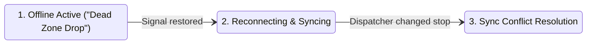

# WayLink Driver System — Comprehensive UX & Product Audit

**Event:** Tech-Triathlon 2026 Designathon (`TeamName_Designathon`)  
**Auditor:** Senior UX Auditor & Product Reviewer  
**Scope:** Driver System (`app/src/`) — Mobile-first, offline-first web application  
**Date & Time:** Tuesday, 29 September 2026, 02:08 PM Sri Lanka time (UTC+05:30)  
**Submission Deadline:** Tuesday, 29 September 2026, 11:59 PM Sri Lanka time  
**Mode:** READ-ONLY Verification (No application files modified)

---

## 1. Screen and State Inventory

| # | Screen / Surface | File Path | Component Name | Implemented States |
|---|---|---|---|---|
| 1 | **Login (Stage A — Sign In)** | `app/src/components/screens/Login.tsx` | `Login` | `default`, `entering` (phone & OTP input), `error` (shake animation on OTP `000000`), `disabled` (submit disabled if phone < 9 digits or code < 6 digits), `toast` ("Token resent via SMS") |
| 2 | **Login (Stage B — Plan & Profile)** | `app/src/components/screens/Login.tsx` | `Login` | `default`, `route_expanded` (accordion open), `route_selected`, `route_in_progress`, `route_completed`, `gps_off`, `gps_locating`, `gps_on`, `gps_blocked`, `gps_unavailable`, `network_good`, `network_fair`, `network_weak`, `network_offline`, `swipe_disabled` (no route selected), `swipe_nudging`, `swipe_dragged`, `swipe_completed` |
| 3 | **Start Meter Photo** | `app/src/components/screens/MeterPhotoScreen.tsx` | `MeterPhotoScreen (moment="start")` | `empty` (viewfinder corner marks & camera icon), `processing` (circular spinner & shimmer), `success` (compressed preview image, animated circular SVG checkmark draw, "Start recorded"), `error` (invalid MIME type or file size > 10MB), `retake` (button during hold phase), `auto_advance` (1250ms hold timer) |
| 4 | **Route Dashboard** | `app/src/components/screens/RouteDashboard.tsx` | `RouteDashboard` | `default`, `up_next_pending`, `up_next_in_progress`, `stop_completed`, `all_stops_completed` ("All stops completed" card), `swipe_finish_ready` (SwipeBar rises when 100% completed), `scrolled`, `network_degraded` (SignalIndicator visible) |
| 5 | **Market Detail (Unpacking Checklist)** | `app/src/components/screens/MarketDetail.tsx` | `MarketDetail` | `default` (checklist unchecked), `item_checked` (120ms draw checkmark), `progressing` (% and bar update), `all_checked` (all products checked, button active with pulse ring), `scrolled` (hairline divider on TopBar), `call_toast` (manager contact prompt). *Missing:* shortfall/damage state, delivery outcome selector |
| 6 | **PIN Confirmation** | `app/src/components/screens/PinConfirmation.tsx` | `PinConfirmation` | `default` (empty 4-digit PIN), `entering` (1–3 digits with active highlight ring), `verifying` (spinner on 4th digit), `success` ("Delivery confirmed" with emerald check), `offline_saved` ("Saved on this phone" with sunburst check), `wrong_pin` (shake animation, decrement attempt count), `locked` (0 attempts left, "Waiting for a new PIN"), `rejected` (store manager reject card with reason), `expired` (PIN expired alert) |
| 7 | **End Meter Photo** | `app/src/components/screens/MeterPhotoScreen.tsx` | `MeterPhotoScreen (moment="end")` | `empty`, `processing`, `success` ("End recorded"), `error`, `retake`, `auto_advance` (routes to `shift_summary`) |
| 8 | **Map Navigation** | `app/src/components/screens/MapNavigation.tsx` | `MapNavigation` | `default` (vector map rendered), `pin_selected`, `arrived` (`driverNearNextOutlet` true, ≈80m indicator), `gps_off` (enable prompt), `all_stops_delivered` ("Finish Route" card), `directions_external` (deep-link to Google Maps), `drawer_expanded` (tablet sequence drawer) |
| 9 | **Shift Summary** | `app/src/components/screens/ShiftSummary.tsx` | `ShiftSummary` | `default` (trip audit metrics), `sync_synced` ("All synced" emerald dot), `sync_pending` ("X outlets waiting to sync" sunburst dot with "Sync now" button), `sync_syncing` (pulsing dot), `multi_route_remain` ("Back to today's plan" primary + "End shift" secondary), `shift_ended` ("End shift" primary), `scrolled` |
| 10 | **End Shift Sheet** | `app/src/components/EndShiftSheet.tsx` | `EndShiftSheet` | `closed` (null), `open` (backdrop + sheet container), `unsynced_warning` (alerts driver if pending outlets remain), `confirm_end` (resets demo state to Stage A), `cancel` |
| 11 | **Sync Queue / Sync Status** | `app/src/components/SyncStatus.tsx` & `app/src/state/store.tsx` | `SyncStatus` / inline store queue | `synced` (emerald dot), `pending` (sunburst dot), `syncing` (pulsing dot), `signal_degraded` (inline SignalIndicator). *Note:* A dedicated full-page Sync Queue screen (`R-04`) does NOT exist; only a summary widget is present |

---

## 2. Traceability Table

| ID | Requirement | Status | Evidence (File & Component) | Severity | Smallest Fix |
|---|---|---|---|---|---|
| **R1** | Follow the route in sequence | **Covered** | `app/src/components/screens/RouteDashboard.tsx` (`RouteDashboard`), `app/src/components/screens/MapNavigation.tsx` (`MapNavigation`) | None | Stop sequence is displayed in numerical order with connecting path lines. |
| **R2** | Record each stop outcome (Delivered, Shortfall, Refused, Closed) | **Partial** | `app/src/components/screens/MarketDetail.tsx` (`MarketDetail`), `app/src/components/screens/PinConfirmation.tsx` (`PinConfirmation`) | **High** | In `MarketDetail.tsx`, add an outcome selector or shortfall flag toggle on items so items can be marked "Shortfall / Damaged" rather than only checked or unchecked. |
| **R3** | Proof of delivery (Store Manager PIN + timestamp) | **Covered** | `app/src/components/screens/PinConfirmation.tsx` (`PinConfirmation`), `app/src/state/store.tsx` lines 293–314 (`completedAt` logged) | None | PIN verification (accepts `4821`), lockout protection, and timestamp logging are implemented. |
| **R4** | Record work offline and queue actions | **Partial** | `app/src/state/store.tsx` lines 304, 320 (`completeOutlet`, `syncStatus: 'pending'`), `app/src/components/screens/MeterPhotoScreen.tsx` line 158 | **High** | Store state is held purely in RAM (`useState`). Refreshing the browser or clearing the tab loses all offline records. Add `localStorage` persistence to `app/src/state/store.tsx`. |
| **R5** | Synchronize when connectivity returns | **Partial** | `app/src/state/store.tsx` lines 315–336 (`syncPendingOutlets`), `app/src/components/SyncStatus.tsx` (`SyncStatus`) | **High** | "Sync now" flips pending items to synced, but conflict handling (reconciling dispatcher changes made while offline) is completely absent. Implement conflict resolution state. |
| **R6** | Receive dispatcher changes (deferrals, route updates) while offline | **Gap** | **Not found** in `app/src/components/screens/` | **High** | Add a dispatcher change banner (`"Route updated 08:30 by Dispatcher"`) and a deferred stop state with reason chip in `RouteDashboard.tsx`. |
| **R7** | Design for use when safely stopped | **Partial** | `app/src/components/shared/SwipeBar.tsx` (`SwipeBar`), `app/src/components/screens/PinConfirmation.tsx` (`PinConfirmation`) | **Medium** | Increase sub-44px touch targets (`Call` link, `Map ›` link) to at least 48px, extend meter photo hold timer from 1.25s to 3s, and eliminate nested list scrolling. |
| **R8** | Navigate to each outlet (Map coordinates + deep-link) | **Covered** | `app/src/components/screens/MapNavigation.tsx` lines 263–270 (`handleDirections` -> Google Maps URL) | None | Outlet coordinates projected onto vector canvas, with external Google Maps intent link. |
| **R9** | Record arrival at each outlet | **Gap** | **Not found** in `app/src/components/screens/MarketDetail.tsx` | **Medium** | In `MarketDetail.tsx`, add an explicit `"I've Arrived"` action button that stamps `arrivedAt: string` into the outlet record. |
| **R10** | Persona grounded in on-road, personal phone context | **Covered** | `Designathon.md` Section 2.3 (Ruwan Kumara, 36) | None | Persona established in project documentation. |
| **R11** | Screen flow with one-paragraph rationale per screen | **Covered** | `Designathon.md` Section 4.3 (R-01 to R-04), documentation Sections 3 & 4 | None | Complete flows documented in design files. |
| **R12** | At least one fully developed named degradation screen | **Gap** | **Not found** as a dedicated screen component in `app/src/components/screens/` or `app/src/App.tsx` | **High** | Build a dedicated screen/modal component named `"Dead Zone Drop"` or `"Offline Sync Conflict"` with the 3 distinct degradation states (Offline, Syncing, Conflict). |
| **R13** | Outlet constraints visible (window < 8 AM, dock type, van_only) | **Gap** | **Not found** in `app/src/components/screens/MarketDetail.tsx` or `RouteDashboard.tsx` | **High** | In `app/src/data/mock.ts`, add `deliveryWindow`, `dockType`, and `accessNote` to `Outlet`; display them as chips (`"Before 08:00"`, `"Rear dock"`) on stop cards. |
| **R14** | Max 2 routes per vehicle per day | **Partial** | `app/src/data/mock.ts` lines 117–142, `app/src/components/screens/Login.tsx` lines 310–449 | **Medium** | `mock.ts` creates 3 routes (Route 1, 2, 3), and all 3 are selectable. Remove Route 3 from `mock.ts` and add a badge `"Daily route limit reached (2/2)"`. |
| **R15** | Driver, vehicle, and depot identity | **Partial** | `app/src/data/mock.ts` lines 55–60, `app/src/components/screens/Login.tsx` line 472 | **Medium** | Replace foreign driver name (`"Marcus Vance"`), generic plate (`"LK-4821"`), and depot (`"North Hub"`) with Sri Lankan values (`"Ruwan Kumara"`, `"WP CAD-5821"`, `"Peliyagoda Central DC"`). |
| **R16** | Consistent use of shared datasets (`outlets.csv`, `vehicles.csv`) | **Gap** | `app/src/data/mock.ts` lines 73–89 | **High** | Update city strings to actual outlet names from `outlets.csv` (e.g. `"Waypoint Fresh - Kandy City Centre"`), vehicle plate to `vehicles.csv`, and vary manager names. |
| **R17** | Delivery record gives Store Manager actionable info | **Partial** | `app/src/components/screens/PinConfirmation.tsx`, `app/src/components/screens/ShiftSummary.tsx` | **Medium** | Delivery record sent from driver currently lacks shortfall details and temperature checks. Add a summary record payload containing accepted vs short items. |
| **R18** | Consistency across roles (WayLink design system, `design.md`) | **Partial** | `app/src/styles/tokens.css`, `app/src/components/shared/TopBar.tsx` line 13 | **Medium** | Update TopBar default title from `"Fleet Logistics"` to `"WayLink"`, and set `--text-primary: #0B1437` instead of `#000000` in `tokens.css`. |
| **R19** | Start & end vehicle meter photo on every route | **Partial** | `app/src/components/screens/MeterPhotoScreen.tsx`, `app/src/components/screens/RouteDashboard.tsx` line 80 | **Medium** | Start meter photo is fully integrated. But `RouteDashboard.tsx:80` and `MapNavigation.tsx:830` call `replaceScreen('shift_summary')`, bypassing `meter_photo_end`. Point `handleFinishRoute` to `meter_photo_end`. |
| **R20** | Deliverables: demo video, AI disclosure, style guide | **Partial** | Documentation draft Sections 10, 11, 13 | **Low** | Complete AI tool disclosure table and finalize 3–5 min video walkthrough script. |

---

## 3. Offline Audit

| User Action | Queued Offline? | What Driver Sees | What Happens on Reconnect | Sync Conflict Handling |
|---|---|---|---|---|
| **Checklist item check** | **No** (Local component state only) | Immediate fill of checkbox circle (120ms duration) and progress bar update (`MarketDetail.tsx:168–181`) | No sync network request is triggered. If app reloads while offline, changes are lost. | **None**. No server diff exists. |
| **Shortfall / damage flag** | **Not implemented** (Feature gap) | Cannot flag shortfalls. Driver must check all items or cannot proceed (`MarketDetail.tsx:212`). | N/A | N/A |
| **PIN confirmation** | **Yes** (`outlet.syncStatus = 'pending'`, `store.tsx:304`) | Sunburst checkmark icon, `"Saved on this phone"`, subtext: `"Delivery recorded offline. Will sync once network returns."` (`PinConfirmation.tsx:238–256`) | On `syncPendingOutlets()`, outlet status updates to `'synced'` and summary changes to `"All synced"` (`store.tsx:322`). | **None**. If dispatch marked outlet deferred or cancelled, driver record silently overwrites without prompt. |
| **Start / End meter photo** | **Yes** (`record.syncStatus = 'pending'`, `MeterPhotoScreen.tsx:158`) | Photo thumbnail preview, animated green checkmark draw, `"Start recorded"` / `"End recorded"` (`MeterPhotoScreen.tsx:313–380`) | `record.syncStatus` changes from `'pending'` to `'synced'` during `syncPendingOutlets()` (`store.tsx:329`). | **None**. Server timestamp does not reconcile with client capture timestamp. |
| **End Shift submission** | **No** (Memory reset) | `EndShiftSheet.tsx:62` displays warning if unsynced items exist: `"X outlets are not synced yet. Stay online until they finish."` If confirmed, calls `resetDemo()` (`ShiftSummary.tsx:146`). | Data was already erased from device memory. Unsynced stops are completely lost. | **None**. No recovery log exists. |

---

## 4. Degradation Screen Assessment

### Current Implementation Assessment
- **Does a named degradation screen exist in the prototype?** **NO**.
- **Rating:** **2 / 10**
- **Explanation:** While `Designathon.md` Section 5.1 specifies the primary degradation screen **"Dead Zone Drop"** and the documentation proposes **"Offline mid-route: saved on this phone"**, no such screen exists in the codebase (`app/src/components/screens/` has no degradation screen, and `App.tsx` has no route for one). Degradation is represented only by passive indicators:
  1. A small `SignalIndicator.tsx` chip (`Network · Offline` with helper text `"Offline: changes will sync once connection returns"`),
  2. A temporary 1.5-second feedback message on PIN entry (`"Saved on this phone"`),
  3. A dot indicator on `ShiftSummary.tsx` (`"2 outlets waiting to sync"`).
- Crucial degradation elements are completely missing:
  - No clear visual affordance that the app has entered an offline cached operating mode mid-route,
  - No active sync progression view when network returns,
  - No conflict resolution interface when dispatcher reallocates or defers a stop while the driver is out of coverage.

### Proposed Implementation (`DeadZoneDegradation`)
Using existing Chameleon design tokens and components, create a dedicated degradation screen/modal with 3 tabbed or sequenced states:

1. **State 1 — Offline Active (`DeadZoneDegradation_Active`):**
   - **Visual:** Persistent Sunburst yellow top banner (`bg-attention/15 border-b border-attention text-attention-900`): `"Offline Mode · Kandy Corridor Dead Zone"`.
   - **Content:** Card explaining: `"3 stops cached on device. You can safely continue deliveries, verify PINs, and take meter photos without connectivity."`
   - **Status Chip:** Each pending stop card displays a sunburst chip: `"Queued locally"`.
2. **State 2 — Reconnecting & Syncing (`DeadZoneDegradation_Syncing`):**
   - **Visual:** Banner turns Cobalt (`bg-action/15 border-b border-action text-action`): `"Signal Restored · Reconciling Records"`.
   - **Content:** Thin progress bar showing `"Syncing 2 of 3 stop records…"`, with checkmarks animating next to each synced stop.
3. **State 3 — Conflict Resolution (`DeadZoneDegradation_Conflict`):**
   - **Visual:** Modal card: `"Sync Conflict: Stop 4 (Kadugannawa)"`.
   - **Comparison Grid:**
     - Left column (*Driver on-site record*): `"Delivered 07:55 · PIN confirmed by Dilini F."`
     - Right column (*Dispatcher server update*): `"Deferred at 07:40 · Reason: Road closure"`
   - **Stated Resolution Rule:** `"Resolution Rule: Physical on-site delivery takes precedence over administrative deferral."`
   - **Actions:** Primary button `"Confirm On-Site Delivery (Notifies Dispatch)"`, Secondary button `"Review Details"`.

---

## 5. Safe-When-Stopped Audit

1. **Sub-48px Touch Targets:**
   - `app/src/components/screens/RouteDashboard.tsx` line 115: `"Map ›"` link has no padding container and an effective hit area of only ~32×24px.
   - `app/src/components/screens/MarketDetail.tsx` line 114: `"Call"` text button next to manager phone has height under 32px (`py-0.5`).
   - `app/src/components/screens/MapNavigation.tsx` line 869: `"Call"` link has text `12px` and icon `14px` (total height ~24px).
   - `app/src/components/screens/Login.tsx` line 161: `"Resend in 0:42"` button has a hit height of ~20px.
   - `app/src/components/shared/TopBar.tsx` line 34: Back button has `-ml-1 py-1` without explicit 48px width/height bounding box.
2. **Timed Prompts & Rushed Transitions:**
   - `app/src/components/screens/MeterPhotoScreen.tsx` lines 187–190: Auto-advances after only **1250ms** (or 800ms on reduced motion). If a driver is stopped in bright sunlight checking whether the odometer digits are legible, 1.25 seconds is too rapid to tap "Retake". *Recommendation: Extend hold to 3000ms with a visible pause/countdown circle.*
   - `app/src/state/store.tsx` line 175: In-app toast dismisses after **1800ms**. While driving or operating a vehicle, scanning toast messages takes 3 to 4 seconds.
3. **Cognitive Load & Decisions Per Screen:**
   - `app/src/components/screens/RouteDashboard.tsx`: Simultaneously renders total route distance, outlets count, time elapsed, progress bar, Up Next card with action button, full list of 14–20 outlets with status dots, and bottom SwipeBar. Stopped drivers should see the active stop and next stop prominently; the historical list should be collapsed by default.
   - `app/src/components/screens/MapNavigation.tsx`: Renders dense decorative SVG elements (terrain zones, river paths, lake text, highway shields A1/A9) that create visual clutter on a phone mounted on a dashboard.
4. **Thumb-Zone Accessibility:**
   - `app/src/components/shared/TopBar.tsx`: Back button is pinned at the top-left margin (`safe-area-inset-top`), requiring two hands or an awkward stretch on phones larger than 6.1 inches.
   - `app/src/components/screens/RouteDashboard.tsx`: `"Map ›"` button is placed at the top-right corner.

---

## 6. Domain Accuracy Findings

| Current Value in Code | Suggested Value (Sri Lankan Context / Datasets) | File and Line |
|---|---|---|
| `name: 'Marcus Vance'` | `name: 'Ruwan Kumara'` | `app/src/data/mock.ts` line 57 |
| `driverId: '8821'` | `driverId: 'DRV-042'` | `app/src/data/mock.ts` line 56 |
| `plateNumber: 'LK-4821'` | `plateNumber: 'WP CAD-5821'` (or from `vehicles.csv`) | `app/src/data/mock.ts` line 59 |
| `vehicleType: 'Isuzu ELF'` | `vehicleType: 'Reefer Truck (5T) - Isuzu ELF'` | `app/src/data/mock.ts` line 58 |
| `Depot: North Hub` | `Depot: Peliyagoda Central DC` | `app/src/components/screens/Login.tsx` line 472 |
| `managerName: 'Nuwan Perera'` (on every outlet) | Vary manager names (e.g. `Dilini Fernando`, `Kamal Silva`). *Nuwan Perera is the Dispatcher persona.* | `app/src/data/mock.ts` line 98 |
| `+1 (800) 555-0199` | `+94 11 234 5678` (Sri Lankan landline) | `app/src/components/screens/Login.tsx` line 485 |
| `routes: 3` (Route 1, Route 2, Route 3) | `routes: 2` (Max 2 routes per day rule) | `app/src/data/mock.ts` lines 117–142 |
| `title: 'Fleet Logistics'` | `title: 'WayLink'` (Waypoint Group) | `app/src/components/shared/TopBar.tsx` line 13 |
| PIN accepted: `'4821'` | PIN accepted: `'1234'` (aligning with documentation specification) | `app/src/components/screens/PinConfirmation.tsx` line 81 |
| Outlet titles: `'Matale'`, `'Kandy'` | Outlets matching `outlets.csv` (e.g. `'Waypoint Fresh - Kandy City Centre'`) | `app/src/data/mock.ts` lines 73–89 |
| Date: `"Monday, Sep 28"` | `"Tuesday, Sep 29, 2026"` (Designathon submission day) | `app/src/components/screens/Login.tsx` line 91 |

---

## 7. Constraint Visibility Findings

- **Delivery Windows (e.g. Fresh before 08:00 AM, Mall fixed windows 06:00–09:00):**
  - **Finding:** **NOT VISIBLE**. Neither `RouteDashboard.tsx` nor `MarketDetail.tsx` displays the outlet's required delivery window. A driver has no way to see that a Fresh drop must be completed prior to 8:00 AM.
- **Dock Types (`rear_dock`, `street`, `mall_bay`):**
  - **Finding:** **NOT VISIBLE**. The driver arrives at an outlet without knowing whether to prepare for rear dock docking, curbside unloading, or a basement mall bay with height restrictions.
- **Access Restrictions (`van_only`):**
  - **Finding:** **NOT VISIBLE**. Outlets accessible only by van are not flagged to the driver.
- **Max 2 Routes per Day:**
  - **Finding:** **NOT ENFORCED**. `app/src/data/mock.ts` defines 3 routes (`Route 1`, `Route 2`, `Route 3`). `Login.tsx` renders all 3 routes in "Today's Plan" and allows selecting and starting any of them. The system fails to enforce the constraint that vehicles are limited to a maximum of 2 routes per day (Monday to Saturday).

---

## 8. Cross-Role Data Table

| Role | Fields Driver Sends | Fields Driver Receives | Store Manager & Dispatcher Deficits |
|---|---|---|---|
| **Store Manager** | Outlet completion status, completion timestamp (`completedAt`), entered PIN confirmation | Store manager name, contact phone number | **CRITICAL DEFICIT:** Store Manager receives no itemized breakdown of shortfalls/damages, no cargo temperature verification, and no estimated time of arrival. |
| **Dispatcher** | Route status (`startedAt`, `finishedAt`), completed outlet count, distance logged, start/end meter photo timestamps | Route number, assigned stop order, planned distance, total package count | **HIGH DEFICIT:** Dispatcher receives no live GPS updates mid-route, no reason codes for delays, and no notification when a stop is skipped or held up. |
| **Loader** | None directly | Pre-trip inspection verification (static text on Login Stage B) | **MEDIUM DEFICIT:** Driver cannot see the loading confirmation timestamp or items flagged short at the loading bay at 3:00 AM. |

---

## 9. Design Consistency Deviations

Audit against `Designathon.md` (Chameleon design system):

1. **Light Mode Primary Text:**
   - `app/src/styles/tokens.css` line 7 & `app/src/styles/globals.css` line 8 define `--text-primary: #000000;`.
   - `Designathon.md` lines 206 and 226 specify `--text-primary` in light mode MUST be Deep Midnight Navy (`--navy-900 #0B1437`).
2. **Dark Mode Action Color:**
   - `app/src/styles/tokens.css` line 30 & `app/src/styles/globals.css` line 46 define `--action: #3370FF;`.
   - `Designathon.md` line 228 specifies dark mode `--action-primary` is Cobalt 300 (`#809FFF`).
3. **Application Title & Branding:**
   - `app/src/components/shared/TopBar.tsx` line 13 sets `title = 'Fleet Logistics'`.
   - `Designathon.md` line 1 defines the system as `WayLink` (Waypoint Group).
4. **Typography & Font Family:**
   - `app/tailwind.config.js` line 43 & `app/src/App.tsx` line 42 specify `-apple-system, BlinkMacSystemFont, "SF Pro Display"`.
   - `Designathon.md` line 256 requires `Inter` as the core UI body font and `Poppins` for display headings.
5. **Primary Action Height:**
   - `app/src/components/screens/MarketDetail.tsx` line 213 uses `h-12` (48px) for the primary "Unpacking Complete" button.
   - `Designathon.md` line 274 explicitly requires: *"driver primary actions 56px tall, full width, placed in the bottom thumb zone"*.
6. **Status Pill Component:**
   - `app/src/components/screens/RouteDashboard.tsx` lines 286–292 renders a bare colored dot and plain text (`Completed`, `In progress`, `Pending`).
   - `Designathon.md` lines 272 and 279 require semantic status pills (`border-radius: 999px`, color + icon + text).

---

## 10. Documentation Facts Per Screen

*(Extracted strictly from code comments and implementation logic)*

- **Screen 1 — Login (Stage A & B)**
  - *Purpose:* Stage A: Confirm device identity to unlock scheduled distribution routes via mobile number and 6-digit OTP. Stage B: Driver profile header, terminal connectivity checks (GPS/Network), and route selection with expandable outlet accordion and swipe-to-start (`Login.tsx` lines 1–8).
  - *Key elements:* Sri Lankan phone input (+94), 6-digit OTP block, GPS status pill with locating trigger, SignalIndicator row, Today's Plan accordion, 56px SwipeBar, pre-trip inspection indicator, switch account button (`Login.tsx:107–498`).
  - *Visible design decisions:* SwipeBar prevents accidental route starts (`Login.tsx:76`); OTP shake animation fires on code `000000`; expanding an accordion does not select the route; GPS button tap triggers locating simulation (`Login.tsx:55`).
- **Screen 2 — Start Meter Photo**
  - *Purpose:* Dedicated full-page vehicle meter photo capture before route departure (`MeterPhotoScreen.tsx:1`).
  - *Key elements:* 4:3 viewfinder capture frame, hidden file inputs with `capture="environment"`, client-side canvas downscaler (1600px max edge), processing spinner, animated SVG circular checkmark draw, "Start recorded" hold text, Retake button (`MeterPhotoScreen.tsx:220–445`).
  - *Visible design decisions:* Auto-advances after 1250ms hold to remove extra tap; bypasses screen if start photo was already taken; validates file MIME type and 10MB size limit (`MeterPhotoScreen.tsx:47, 97`).
- **Screen 3 — Route Dashboard**
  - *Purpose:* Follow route sequence, view overall progress, access map view, and launch stop delivery (`RouteDashboard.tsx:1`).
  - *Key elements:* Route header with total outlets and km, progress bar with elapsed time, Up Next card with dynamic "Current Outlet" / "Up Next" chip, sequential outlet list with connector lines, finish route SwipeBar when all done (`RouteDashboard.tsx:101–317`).
  - *Visible design decisions:* Back button returns to Today's Plan; completed outlets are locked/dimmed; Map button in header links to map view (`RouteDashboard.tsx:36, 113`). Shortfall flagging: *Not stated*.
- **Screen 4 — Market Detail (Unpacking Checklist)**
  - *Purpose:* Item-by-item verification and unpacking checklist at delivery stop (`MarketDetail.tsx:1`).
  - *Key elements:* Outlet header, manager name and call link, animated progress bar with % unpacked, checklist items with circular checkboxes, bottom pinned action button (`MarketDetail.tsx:90–228`).
  - *Visible design decisions:* Action button pulses with accent ring when 100% checked; scrolling past 4px adds hairline to TopBar; tapping checked item unchecks it (`MarketDetail.tsx:36, 50`). Shortfall flagging: *Not stated*.
- **Screen 5 — PIN Confirmation**
  - *Purpose:* Store manager proof of delivery via 4-digit PIN entry on driver's phone (`PinConfirmation.tsx:1`).
  - *Key elements:* Store name, manager phone, 4 PIN digit boxes with active focus ring and shake animation, custom 10-digit keypad, approved/rejected states, offline-saved feedback (`PinConfirmation.tsx:146–355`).
  - *Visible design decisions:* Hardcoded PIN `4821` accepted; 3 incorrect attempts trigger lockout (`PinConfirmation.tsx:81, 114`); manager reject shows reason card; auto-advances to End Meter Photo on final stop (`PinConfirmation.tsx:88`).
- **Screen 6 — End Meter Photo**
  - *Purpose:* Record final vehicle odometer reading at route completion before shift summary (`MeterPhotoScreen.tsx:1, 217`).
  - *Key elements:* Viewfinder, capture triggers, checkmark animation, "End recorded" hold text (`MeterPhotoScreen.tsx:218`).
  - *Visible design decisions:* Triggered automatically upon completion of the final stop in `PinConfirmation.tsx:92`.
- **Screen 7 — Map Navigation**
  - *Purpose:* Visual route overview and navigation guidance to stops (`MapNavigation.tsx:1`).
  - *Key elements:* Interactive vector map (SVG) with terrain, water bodies, highway shields, outlet pins with sequence numbers, driver pulse pin, recenter button, GPS prompt, bottom outlet card with "Directions" (Google Maps) and "Open" (`MapNavigation.tsx:321–910`).
  - *Visible design decisions:* Vector map works without external map API; directions button opens external Google Maps intent; bottom card adapts to portrait/landscape (`MapNavigation.tsx:263, 818`).
- **Screen 8 — Shift Summary & End Shift Sheet**
  - *Purpose:* Review completed route audit figures, verify sync status, and end driver shift (`ShiftSummary.tsx:1`).
  - *Key elements:* Emerald completion mark, 3 key figures (outlets, items, distance) + total time, SyncStatus line with "Sync now" button, collapsible OutletSummaryList, bottom action button, EndShiftSheet modal (`ShiftSummary.tsx:163–270`).
  - *Visible design decisions:* Staggered entrance animation (40ms steps); warns if unsynced items remain; ending shift resets demo (`ShiftSummary.tsx:103, 144`). Vehicle condition sign-off and odometer input: *Not stated*.

---

## 11. Judging-Criteria Scores

| Criterion | Weight | Score (0–10) | Justification |
|---|:---:|:---:|---|
| **Problem framing** | 25% | **6.5** | Core offline synchronization and PIN proof-of-delivery concepts are well targeted to the brief's pain points. However, the system fails to frame and handle mid-route dispatcher changes or shortfall recording at the stop. |
| **Understanding of user context** | 20% | **6.0** | Touch targets on primary flows (SwipeBar, PIN keypad) reflect outdoor on-road use. However, multiple sub-44px click targets, aggressive 1.25s auto-advancing, and missing outlet dock/access constraints weaken context fit. |
| **Degradation screen quality** | 15% | **3.0** | A dedicated named degradation screen does not exist in the prototype. Only minimal inline feedback chips are implemented, leaving offline caching and reconnect conflict resolution unrepresented. |
| **Domain accuracy** | 10% | **4.0** | Outlets and roads are placed in Central Province (Kandy, Matale), but mock data uses foreign names ("Marcus Vance"), US dispatch phone numbers, 3 routes instead of max 2, and ignores outlet constraints. |
| **Scope and prioritization** | 15% | **7.0** | The end-to-end happy path (Login → Start Meter → Dashboard → Map → Checklist → PIN → End Meter → Summary) is fully clickable and functional. Secondary administrative clutter was appropriately rejected. |
| **Visual & interaction design** | 15% | **7.5** | High visual polish with Apple-inspired fluid typography, smooth SVG checkmark draw animations, and cohesive dark/light mode tokens. Deviations include incorrect `--text-primary` hex and non-standard TopBar branding. |

---

## 12. Top 10 Prioritized Fixes

Ranked by **Impact-to-Effort Ratio** (Score Gain ÷ Implementation Time):

| # | Priority Fix | Target File & Component | Planned Change | Est. Time | Score Gain |
|:---:|---|---|---|:---:|:---:|
| **1** | **Build Named Degradation Screen ("Dead Zone Drop")** | `app/src/components/screens/DeadZoneDegradation.tsx` & `app/src/App.tsx` | Create a named degradation screen with 3 toggleable states: 1) Offline Active (sunburst banner, cached work), 2) Syncing on Reconnect (progress line), 3) Conflict Resolution (driver on-site record vs dispatcher deferral). Add to Figma switcher dock. | 40 min | **+2.0** |
| **2** | **Localize Mock Data to Sri Lankan Fleet & Context** | `app/src/data/mock.ts` lines 55–60 & `app/src/components/screens/Login.tsx` | Change driver to `"Ruwan Kumara"`, ID `"DRV-042"`, plate `"WP CAD-5821"`, depot to `"Peliyagoda Central DC"`, dispatch support to `"+94 11 234 5678"`, and vary outlet manager names. | 15 min | **+1.5** |
| **3** | **Surface Outlet Constraints (Windows & Dock Types)** | `app/src/data/mock.ts` & `app/src/components/screens/MarketDetail.tsx` | Add `deliveryWindow: "Before 08:00 AM"` and `dockType: "Rear dock"` to `Outlet` model; display constraint tag chips on `MarketDetail.tsx` and `RouteDashboard.tsx`. | 25 min | **+1.2** |
| **4** | **Add Shortfall / Damage Flagging at Stop** | `app/src/components/screens/MarketDetail.tsx` lines 160–205 | Add an item-level shortfall toggle (`"Mark Short / Damaged"`) so unpacking can complete with noted discrepancies instead of requiring an all-or-nothing check. | 30 min | **+1.2** |
| **5** | **Fix System Branding & Navy Design Tokens** | `app/src/styles/tokens.css` line 7 & `app/src/components/shared/TopBar.tsx` line 13 | Change TopBar default title from `"Fleet Logistics"` to `"WayLink"`, and set `--text-primary: #0B1437` (Midnight Navy) in light mode to match `Designathon.md`. | 10 min | **+0.8** |
| **6** | **Enforce Max 2 Routes Daily Limit** | `app/src/data/mock.ts` lines 117–142 & `app/src/components/screens/Login.tsx` | Remove Route 3 from `mock.ts` (limit fleet plan to 2 routes). On `ShiftSummary.tsx`, if 2 routes completed, show `"Daily route limit reached (2/2)"`. | 15 min | **+0.6** |
| **7** | **Fix End Meter Photo Routing Leak** | `app/src/components/screens/RouteDashboard.tsx` line 80 & `MapNavigation.tsx` line 830 | Update `handleFinishRoute` so it checks `meterPhotos[routeId]?.end`; if missing, redirect to `meter_photo_end` instead of bypassing directly to `shift_summary`. | 15 min | **+0.5** |
| **8** | **Add Explicit "Arrived" Timestamp Action** | `app/src/components/screens/MarketDetail.tsx` line 120 | Add an `"Arrived at Outlet"` button/chip that records `arrivedAt` timestamp when pressed, satisfying requirement `R9`. | 15 min | **+0.5** |
| **9** | **Fix Safe-When-Stopped Touch Target Violations** | `MarketDetail.tsx`, `RouteDashboard.tsx`, `MeterPhotoScreen.tsx` | Enlarge `"Call"` and `"Map ›"` click areas to minimum 48px, extend meter photo hold timer from 1.25s to 3s, and increase toast duration to 3.5s. | 20 min | **+0.5** |
| **10** | **Add Vehicle Sign-off & Final Odometer to End Shift** | `app/src/components/EndShiftSheet.tsx` lines 50–70 | Add final odometer reading input and a pre-shift / post-shift vehicle condition sign-off checkbox to `EndShiftSheet.tsx`. | 20 min | **+0.4** |
